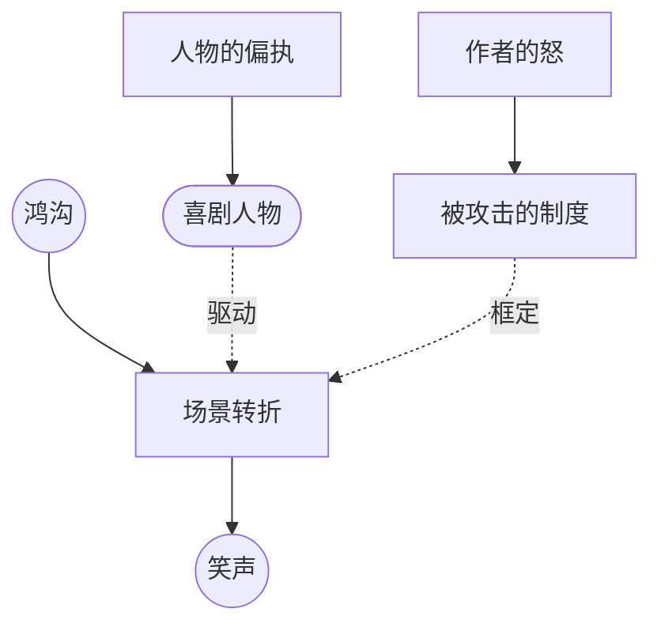

# 喜剧设计（Comic Design）

> English: [[wiki/en/concepts/comic-design|English]]

## 定义
**喜剧设计**是打造一部能制造笑声的故事的技艺。它遵循与戏剧相同的结构原则——转折点、鸿沟、价值转变——但额外带有三项特征：社会／制度靶标、偏执的人物、以及把鸿沟炸裂为笑声的场景转折。

## 麦基的论述
喜剧感性是受挫的理想主义者：世界**本应**完美，却贪婪、腐败、荒唐。要修复薄弱的喜剧，作者先问："我到底在气什么？" 然后选定那个让自己血压上升的社会制度——其虚伪正是靶标。片名往往直接点名：*统治阶级*、*陆军野战医院*、*动物屋*、*电视台风云*、*奇爱博士*。

喜剧**人物**不同于戏剧人物，带着自己看不见的**盲目偏执**（humour）。一旦喜剧人物认出自己的偏执，喜剧即刻终止（*一条叫旺达的鱼*中 Archie Leach 一旦认出自己对难堪的恐惧，便从喜剧主角变作言情男主）。

喜剧**结构**的容忍度高于戏剧：可以有只为笑料而存在的场景；可以有一定程度的巧合；若主人公已经受够了苦且从未绝望，连机械降神也被允许。但场景的转折方式与戏剧完全一致——鸿沟炸开，区别在于爆发的是笑声，而非见地。

## 运作机制
- **找到怒**。指认让你愤懑的社会制度，对它开火。
- **给主人公一个 humour**。一项他看不见的盲目偏执。
- **每个场景必须转**。对每一次行动问："它的反面是什么？再离经叛道一步是什么？"
- **把鸿沟拉得更宽、更荒唐**。喜剧是鸿沟更大的戏剧。
- **允许叙事旁枝**。若一场戏笑到让人停不下，却不推动情节，它仍可能属于这部影片——只要影片还是一部**故事**，而不是段子合辑。
- **以口述检验**。真喜剧在你口头讲述故事（不引用台词）时就让听者发笑。若他们不笑，你写的是正喜剧、犯罪喜剧，或别的什么——不是喜剧。

## 电影案例
- [[trading-places|*颠倒乾坤*]]——攻击统治阶级；笑声活在一条不断张大的鸿沟上。
- *一条叫旺达的鱼*——四种偏执互相撞击：语言、智识、动物、难堪。
- *吝啬鬼*、*无病呻吟*——莫里哀的 humour 型设计。
- *小店魔声*——牙医与受虐狂那场戏：无情节功能，纯粹喜剧转折。
- *淘金记*——在充分受苦之后，被允许的喜剧式机械降神。

## 与其他概念的关系
- 建立在鸿沟（[[the-gap]]）和转折点（[[turning-point]]）的更大振幅上。
- 需要带 humour 的喜剧人物（[[comic-character]]）。
- 仍可承载主控思想（[[controlling-idea]]）——愤怒理想主义者对某种具体社会愚行的论证。

## 常见错误
- 写段子去找故事，而非写一个会转为段子的故事。
- 让喜剧主角过早认出自己的偏执。
- 把机智混同为喜剧设计——*安妮·霍尔*（正喜剧）、*致命武器*（犯罪喜剧）是杂交，不是真喜剧。
- 做一部"和气"的喜剧而无愤怒靶标——笑声没有可推的对象。

## 来源
- 《故事》第16章（喜剧的问题）
- 《故事》第17章（喜剧人物）
