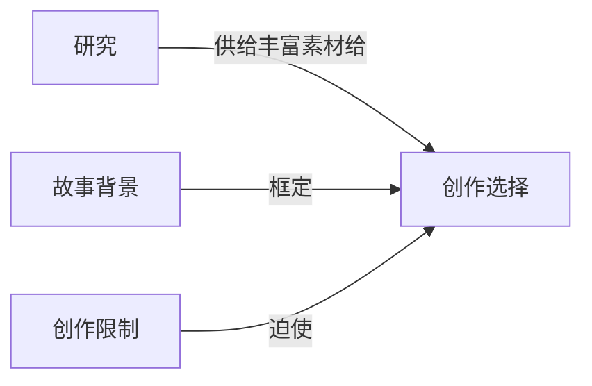

# 创作选择（Creative Choices）

> English: [[wiki/en/concepts/creative-choices|English]]

## 定义

创造力不是一比一的——不是精确设计出所需的事件然后填入对白。它是五比一、十比一、甚至二十比一。这门手艺要求创造出远超实际需要的素材，然后从这些数量中精明地筛选出质量。**创造力意味着对取舍的创作选择。**

## 概念关系图

## 麦基的论述

麦基认为，第一个想法几乎总是陈词滥调。"灵感"通常只是从你头顶上随手抓取的第一个念头——而趴在那里的是你看过的每一部电影、读过的每一部小说，提供着可供回收的素材。真正的灵感来自更深的源泉，只有通过有纪律的超量创作才能触及。

方法是：对于任何给定的故事时刻，列出五个、十个、十五个不同的版本。不必完整写出——只需勾勒大致轮廓。然后审视清单，问自己：哪个最忠于角色？最忠于世界？从未以这种方式出现在银幕上？那一个就写入剧本。

如果你完成的剧本包含了你写过的每一个场景，你从未丢弃过任何想法，那这部作品几乎注定会失败。"除非你虚荣到愚蠢的地步，把失败之作展示出来，否则没人需要看到它们。"

## 运作机制

1. **大量产出** — 对每个关键场景或时刻，头脑风暴出多种变体（5-20个以上）。
2. **用三个标准检验每一个：** 最忠于角色？最忠于世界？从未以这种方式呈现过？
3. **选择最好的，烧掉其余的** — 只保留最优秀的10%素材。
4. **如果最好的想法是陈词滥调，** 继续深挖——在那个陈词滥调内部创建新的变体清单，直到找到其中的真相。

## 电影案例

- 麦基的假设案例：写一部设在曼哈顿东区的浪漫喜剧，"单身酒吧邂逅"是第一个想法——一个陈词滥调。作者列出替代方案（公园大道爆胎、办公室圣诞派对洗手间救援等），或者，如果单身酒吧确实最合适，就深入研究那个世界，直到在陈词滥调中找到真实。

## 与其他概念的关系

- [[creative-limitation]]（创作限制）— 限制为有意义的选择创造条件
- [[research]]（研究）— 研究为创作筛选所依赖的超量创作提供养料
- [[setting]]（故事背景）— 对背景的深入了解使更多更好的创作替代方案成为可能

## 常见错误

- 相信"灵感"——第一个想法通常是借来的
- 只写刚好需要的素材，没有余量
- 爱上一个场景并拒绝删减，尽管知道它平庸
- 从不进行真正的改写，只是微调对白

## 来源

- 《故事》第3章，"创作选择"
