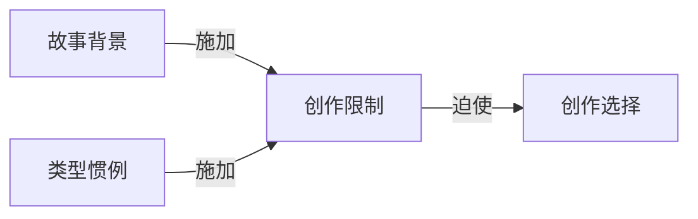

# 创作限制（Creative Limitation）

> English: [[wiki/en/concepts/creative-limitation|English]]

## 定义

创作限制原则认为，约束激发创造力而非抑制创造力。结构与背景（或类型）之间的关系限制了创作选择——而正是这种限制产生了原创性。在一圈障碍之内的自由，才是才华得以茁壮成长的条件。

## 概念关系图

## 麦基的论述

麦基将此表述为一种反讽："世界越大，作者的知识越稀薄，因此创作选择越少，故事也就越充满陈词滥调。世界越小，作者的知识越完整，因此创作选择也就越多。"艺术家渴望自由，但不受约束的自由导致表面化。正是在明确限制内工作的纪律——一个具体的背景、一种类型的惯例——迫使想象力挖得更深。

在第4章中，麦基将这一原则延伸到类型，引用罗伯特·弗罗斯特的话："写自由体诗就像把网拆掉打网球。"类型惯例是故事讲述者"诗篇"的"韵律方案"。诗人随意决定隔行押韵，可能会逼出一个与诗歌毫无明显关系的词——但那个随机的词却释放出意象，将诗歌推向更丰富的意义。同样，类型惯例迫使作者在既有模式中找到新鲜的解决方案。

## 运作机制

1. **定义边界** — 选择一个具体的、可知的背景，并确定支配故事的类型惯例。
2. **掌握约束** — 深入研究世界和类型，直到了解这些边界内的每一种可能性。
3. **在限制中创作** — 以独特方式履行惯例的挣扎，正是灵感所在。约束本身成为催化剂。

"才华就像肌肉：没有东西可以推，它就会萎缩。"

## 电影案例

- **《奇爱博士》**（*Dr. Strangelove*）— 三个场景，八个角色。物理空间的严格限制迫使库布里克和索恩将所有讽刺能量集中到一个微小的世界中，产出了电影史上最伟大的喜剧之一。
- **《夺宝奇兵》**（*Raiders of the Lost Ark*）— 英雄在恶棍手下的惯例迫使产出了一个新鲜的解决方案：印第安纳·琼斯直接开枪射杀了挥舞弯刀的对手，这个因约束（哈里森·福特生病）而诞生的瞬间成为了经典。

## 与其他概念的关系

- [[setting]]（故事背景）— 背景是第一个创作限制；它定义了什么是可能的
- [[genre-conventions]]（类型惯例）— 类型惯例是像诗人韵律方案一样运作的创作限制
- [[creative-choices]]（创作选择）— 创作限制要求超量创作，然后从丰富的素材中严格筛选

## 常见错误

- 将约束视为应该规避的障碍，而非应该拥抱的催化剂
- 选择过于庞大的背景，导致知识变得表面化
- 以"艺术自由"的名义忽视类型惯例，导致作品失去形式
- 将限制与公式化重复混淆——关键是在已知边界内的新鲜执行

## 来源

- 《故事》第3章，"创作限制原则"
- 《故事》第4章，"创作限制"
