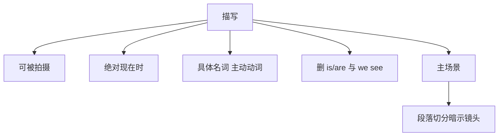

# 描写（Description）

> English: [[wiki/en/concepts/description|English]]

## 定义
**描写**是剧本中除对白以外的叙述文本——把电影投入读者脑海的那部分文字。写得好时，它让读者在翻页时产生"正在看电影"的感觉。

## 麦基的论述
语言表达的 90% 在银幕上没有等价物。编剧因此要不停自问：**银幕上能看到什么？** 然后只写**能被拍摄的内容**，保持**绝对现在时**，并呈现生动的动作。

四条规则：

- **具体名词与主动动词**。用"spike"（铆钉）而非"大钉子"；用 padded、saunter、teeter、shuffle，而不是 "move slowly"。
- **剔除 is/are**。银幕上没有静止的存在，只有正在变化。
- **删掉不可被拍摄的比喻**。"as if" 在银幕上不存在。
- **删掉 "we see/we hear" 与多数镜头标注**。当代剧本是**主场景**文档。

## 运作机制
- **电影性测试**。每一行自问：银幕上看到什么？删掉不可被拍摄的。
- **动词写行动**。把"弱动词 + 副词"换成一个精准的动词。
- **命名事物**。具体名词胜过"形容词 + 泛名"。
- **主场景的纪律**。只写故事需要的角度，用段落切分**暗示**——广角、移动、特写——而不用镜头标签命令。
- **删掉 CUT TO / SMASH CUT TO / LAP DISSOLVE TO** 等。
- **不要做镜头指令**。演员忽略过度的行为微管理，导演忽略"RACK FOCUS TO"；两者都破坏沉浸。

## 电影案例
- Lean、Bergman、Towne、科恩兄弟的剧本好读，是因为描写把电影投了出来。
- 反例：欧洲投稿中的句子（"夕阳如丛林中闭合的虎眼"）——文辞美，却不可被拍摄。
- 反例：美国作者以讽刺作描写（"你猜对了，性爱戏来了……"）——以机智掩饰写不下来的无力。

## 与其他概念的关系
- 在无声剧本（[[silent-screenplay]]）教义下高于对白（[[dialogue]]）。
- 是影像系统（[[image-systems]]）的最早、最大落位点。
- 与演员、导演协作；为他们留白。

## 常见错误
- 不可被拍摄的比喻与明喻。
- 副词＋泛动词，而非一个精确动词。
- 试图在纸上"导演"电影的镜头指令。
- 过度描写行为，挤掉演员。
- "we see/we hear" 打断读者沉浸。

## 来源
- 《故事》第18章
