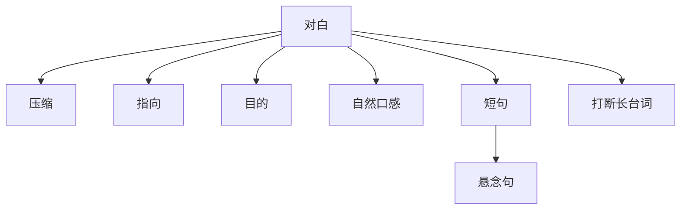

# 对白（Dialogue）

> English: [[wiki/en/concepts/dialogue|English]]

## 定义
**对白**是银幕上的说话——不是转录的日常对话。麦基定义为：听起来像生活、但以**压缩、指向、目的**运作的语言；每一句要么让节拍转动，要么在向场景的转折点（[[turning-point]]）推进。

## 麦基的论述
真实对话"只求保持通道畅通"——很少作结论、很少收尾。若把它搬上银幕，观众会死。银幕对白必须：

- **压缩**：用最少的字说最多的事。
- **指向**：每一次交换都推动节拍朝一个方向，不重复。
- **目的**：每一句都执行一条通向场景转折的设计。
- **自然**：缩略、断句、俗语、必要时的脏话。
- **短**：结构简单的句子——主语—动词—宾语。
- **首选悬念句**（[[suspense-sentence]]）：含义被推迟到最后一词，迫使演员与观众都听到句尾。
- **打断长台词**：用行动／反应的节拍打碎任何"独白"；人物可对自身反应。

电影是 80% 的视觉。对白是剧本的**最后一层**；形象高于语言。参见无声剧本（[[silent-screenplay]]）。

## 运作机制
- **亚里士多德的规矩**："像平民那样说话，但要像智者那样思考。"
- **朗读检验**。避免绕口令与意外押韵；页面是为演员写的。
- **剪掉卖弄的句子**。凡是在页面上"炫技"的——都删。
- **打断每一段长台词**。插入沉默反应或括号提示，让说话者改变节拍。
- **给演员留白**。对白含义的一半来自面孔与动作；脱画的嗓音让潜文本变平。
- **把铺陈走"弹药"**。参见[[exposition-as-ammunition]]。

## 电影案例
- *莫扎特传*——Salieri 对神父的告解，被沉默反应与括号节拍打碎（神父低头、窘迫、对莫扎特的记起而恼火……）。
- *卡萨布兰卡*——Rick 与 Ilsa 的双关对话：表面说一套，潜文本活着。
- *沉默*——"侍者诱惑"全无一句台词；反面范例。

## 与其他概念的关系
- 含文本与潜文本（[[text-and-subtext]]）：表面是文本；生命是潜文本。
- 从属于描写（[[description]]）与形象——见无声剧本（[[silent-screenplay]]）。
- 承载铺陈即弹药（[[exposition-as-ammunition]]）。
- 句法上被悬念句（[[suspense-sentence]]）塑形。

## 常见错误
- 把"对话"写成对白。
- 文学腔的句子跳出页面。
- 忘了行动／反应的独白。
- 绕口令、意外押韵、空转介词尾巴。
- 让两人都已知的事成为对白。
- 在潜文本就位之前就写对白（见第19章 [[chapter-19-a-writers-method]]）。

## 来源
- 《故事》第18章
