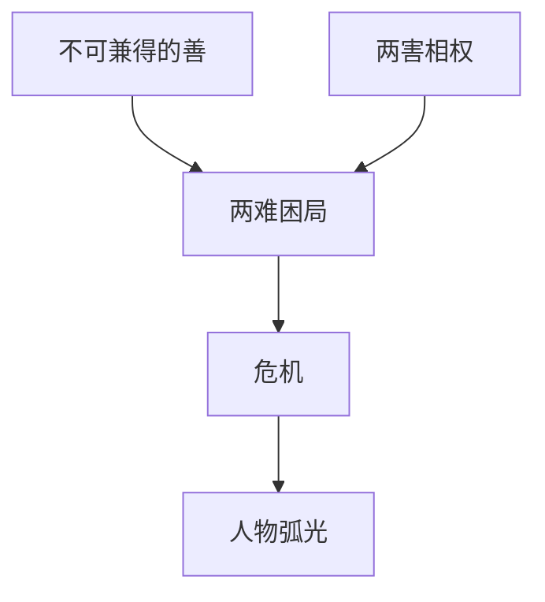

# 两难困局（Dilemma）

> English: [[wiki/en/concepts/dilemma|English]]

## 定义
两难困局（Dilemma）是真正的戏剧性选择：要么是两种都想要、却无法兼得的好东西；要么是两种都不想要、却必须择其一的坏结果。

## 麦基的论述
善恶对立通常不是真选择，因为从人物自己的立场看，其中一个早已是“正确答案”。真正暴露人物的，是两边都要付出代价、都要牺牲重要之物的局面。因此，危机时刻比任何台词都更能揭示深层性格。

## 运作机制

## 电影案例
- **[[thelma-louise]]**（《末路狂花》）— 监禁与死亡都不可接受，但必须选其一。
- **[[ordinary-people]]**（《凡夫俗子》）— 卡尔文在家庭维系与家庭真相之间被撕开。
- **[[the-empire-strikes-back]]**（《帝国反击战》）— 卢克连续面对没有“干净结果”的选择。

## 与其他概念的关系
- [[crisis]]（危机）— 危机正是两难困局最集中的现场。
- [[protagonist]]（主人公）— 主人公最终由这次选择定义。
- [[character-arc]]（人物弧光）— 人物弧光会在最深压力下的选择中收束。
- [[story-climax]]（故事高潮）— 被选中的行动会变成高潮。

## 常见错误
摇摆不定不等于两难。故事如果只是来回“是/否”摆荡，很容易重复，也难以真正闭合。

## 来源
- 《故事》第13章

