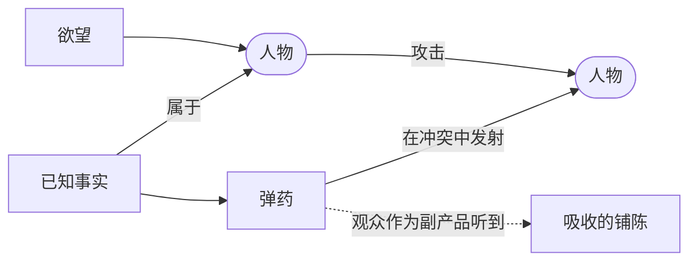

# 铺陈即弹药（Exposition as Ammunition）

> English: [[wiki/en/concepts/exposition-as-ammunition|English]]

## 定义
**铺陈即弹药**是麦基处理铺陈的助记规则：人物了解自己的世界、历史、彼此以及自己——让他们在追逐欲望的战斗中**使用**这些知识作为武器。观众在火线上作为副产品接收到事实。

## 麦基的论述
新手把铺陈视为对观众的"义务"，必须"先处理掉"。于是 Jack 对 Harry 说："我们认识多久了？二十年，从大学起就认识？"——这两个角色谁都不需要这句话。大师把框架颠倒过来：如果 Jack 需要 Harry 改掉毛病，他就把过去当石头砸过去："还是嬉皮发型，还是中午就吸大麻，还是二十年前把你逼出学校的那些蠢事。" 观众在观看争斗的同时吸收事实。

## 运作机制
- **为每个人物建立完整档案**：传记、怨恨、秘密、专长。然后**让他们用**。
- **先放需要，再放事实**。如果角色此刻没有理由把这条事实武器化，那这个时刻就是错的。
- **先设冲突，再嵌事实**。先设计戏剧需要，再把铺陈负载穿进去。
- **首选潜文本**。最锋利的弹药往往作为暗示落地；观众的视线跳向反应镜头，同时顺耳接到一段过去或一段关系。
- **在冲突法则（[[law-of-conflict]]）之下运行**：场景必须转折，事实正好搭顺风车。

## 电影案例
- **[[casablanca]]** 卡萨布兰卡——Rick 与 Ilsa 的巴黎往事，由醉中对峙、嫉妒、双关带出。事实是攻击的载荷。
- **[[chinatown]]** 唐人街——Cross 与 Gittes 互相把过去当威胁交换。每一次铺陈镜头都带动机。
- *义海雄风*（*A Few Good Men*）——高潮处的"你受不了真相"是作为武器发射的铺陈，而非演讲。

## 与其他概念的关系
- 是戏剧化而非讲述（[[dramatize-dont-explain]]）在铺陈（[[exposition]]）上的操作形态。
- 由冲突法则（[[law-of-conflict]]）塑形——冲突是载体，事实是货物。
- 经常走文本与潜文本（[[text-and-subtext]]）的路径：表层言语做一件事，铺陈在下面同行。

## 常见错误
- 让人物讲双方早已知道的事。
- 弹药装填的是泛泛背景（"你知道，我是你哥哥"），而非尖利有效的事实。
- 一次性开火过猛——一轮用完，后续转折便无弹可打。

## 来源
- 《故事》第15章
