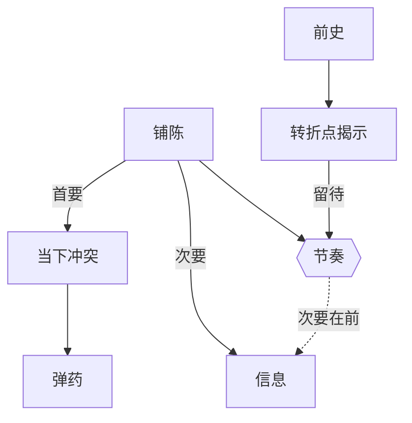

# 铺陈（Exposition）

> English: [[wiki/en/concepts/exposition|English]]

## 定义
**铺陈**是观众理解故事所需的关于设定、人物传记、人物塑造的信息。处理到位时，铺陈是**隐形**的：事实作为冲突的副产品悄然进入观众的认知。

## 麦基的论述
铺陈的处理方式，是衡量作家技艺最清晰的标尺。新手写那种"只为摆事实而存在"的场景；大师写人物为自己欲望而战、并顺带把事实当作弹药的场景。铺陈有两项任务，**顺序至关重要：首要任务是推动当下的冲突；次要任务才是传递信息。** 新手把二者颠倒，于是出现"加州场景"（陌生人见面即交心忏悔）或"抹桌子"（仆人互相介绍双方都早已知情的旧事）。

观众的兴趣不靠"给信息"维持，而靠"扣信息"维持——只交出理解所必需的那一部分，同时靠激发好奇制造"想知道的欲望"。

## 运作机制
- **戏剧化，而非解释**。每一条事实都通过人物此刻在意之事的行动传递。
- **转化为弹药**。让人物用他们所知的东西去争取他们想要的东西。听者是在火线上接收事实。
- **节奏化**。次要事实先出，关键事实后出，最深的秘密（来自前史 [[backstory]]）留给幕高潮。
- **制造"想知道"的需要**。不是倾倒信息，而是在观众心中种下一个"为什么？"，再在后面兑现。
- **跳过可推断的**。任何观众能合理推断出的内容都不必给。
- **选择恰当的载体**。闪回（[[flashback]]）、梦境、蒙太奇、画外音都是铺陈形式；必须要么戏剧化，要么构成对位，不可用作装饰。

## 电影案例
- **[[chinatown]]** 唐人街——"她既是我妹妹也是我女儿"作为留存的铺陈，在第二幕高潮处爆炸。
- **[[the-empire-strikes-back]]** 帝国反击战——"我是你父亲"，是推至最大转折点才兑现的前史铺陈。
- **[[casablanca]]** 卡萨布兰卡——关于 Rick 过去的信息，由争吵、嫉妒、双关进入——从不以演讲的形式出现。
- *落水狗*——失败的抢劫被扣下，随后在仓库戏节奏下坠时闪回。

## 与其他概念的关系
- 是铺陈即弹药（[[exposition-as-ammunition]]）的操作形态。
- 取自前史（[[backstory]]），常通过闪回（[[flashback]]）传递。
- 作为铺垫与回报（[[setup-and-payoff]]）兑现，并构成转折点（[[turning-point]]）的揭示面。
- 部分栖身于文本与潜文本（[[text-and-subtext]]）中——未说出口的往往暴露得更多。

## 常见错误
- **抹桌子**：两个角色互相讲双方都已知的事。
- **加州场景**：萍水相逢便互吐深层秘密。
- **前置堆砌**：在第一幕把铺陈集中倒出，以"先解决掉"。
- **直白的闪回／旁白**：重复已清楚的信息，或以解说替代戏剧。
- **悬念式拖延**：用一段将来才兑现的精彩戏码，替一段三十分钟的无聊做遮羞。

## 来源
- 《故事》第15章
- 《故事》第8章（首次在前史[[backstory]]中出现）
