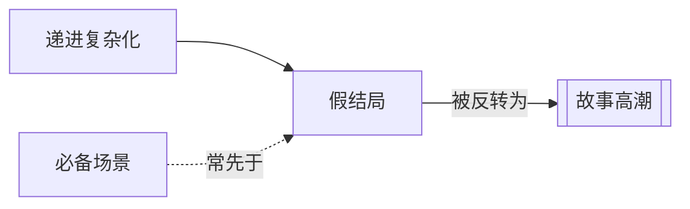

# 假结局（False Ending）

> English: [[wiki/en/concepts/false-ending|English]]

## 定义
**假结局**是一场通常出现于第三幕后段的戏，其完结感如此强烈，以致观众片刻间误以为故事已经结束；随后一次终极反转揭示真正的高潮。

## 麦基的论述
假结局是一种高级技法，最适合长篇形式（两小时以上的电影）及观众已被铺垫出胜利或失败预期的类型。它先释放张力，让真正的[[story-climax]]（故事高潮）得以更强力地击中观众。若用之不当，会令人觉得被耍；若用得精当，情感收益成倍放大。

## 电影案例
- *异形2* — 蕾普莉看似逃脱；随后女王从起落架中现身。
- *沉默的羔羊* — 克劳福特团队扑空；克拉丽斯才是敲响野牛比尔家门的那个人。

## 与其他概念的关系
- [[story-climax]]（故事高潮）— 假结局的存在是为了让真正的高潮更锋利。
- [[obligatory-scene]]（必备场景）— 假结局可能伪装成必备场景。
- [[progressive-complications]]（递进复杂化）— 假结局是最后一次、最深的复杂化。

## 常见错误
- 故事尚未赢得这种误导权时就使用假结局。
- 假结局使观众泄气而非被抬升。

## 来源
- 《故事》第9章
