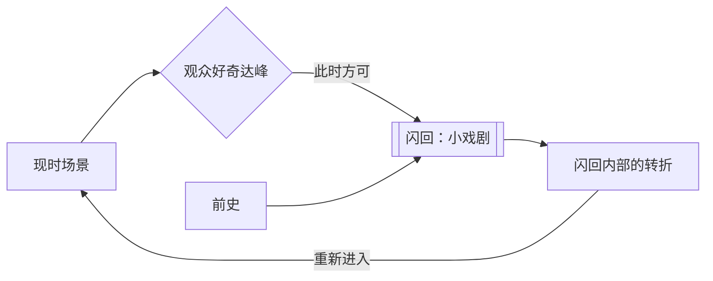

# 闪回（Flashback）

> English: [[wiki/en/concepts/flashback|English]]

## 定义
**闪回**是用来揭示铺陈（[[exposition]]）的、戏剧化的过去片段。处理得好的闪回本身就是一个**小戏剧**，拥有自己的激励事件、递进和转折，并且**加速**节奏而非拖慢。

## 麦基的论述
闪回是一种铺陈，遵循铺陈的所有规则：戏剧化、节奏、扣留、回报。制片人常说闪回拖沓——若处理不好，确实如此；但如果它只在观众**渴求**它出现时才登场，且像其他场景一样**内部转折**，它读起来就是向前的动量。"直到你已经在观众心中制造了想知道的需要和欲望之前，都不要带入闪回。"

## 运作机制
- **戏剧化**。闪回要有自己的激励事件、递进与转折——不是幻灯片式的摆事实。
- **把关入口**。只有当现时故事抛出了迫切的问题时，才让闪回登场。
- **让它做事**。回到现时时，闪回应当改变观众对现时场景的理解。
- **选形式**：
  - *卡萨布兰卡型*：闪回在幕的转折处降临，为影片加速。
  - *克里斯蒂／落水狗型*：以罪行被发现或逃逸为开场，再闪回缺失的那一半；好奇向过去和未来两端展开。
- **保持电影性**。闪回不是小说式的自由联想；镜头对一切矫揉造作都有 X 光般的穿透。

## 电影案例
- **[[casablanca]]** 卡萨布兰卡——第二幕开头的巴黎闪回，拖到观众渴望得知之时才抛出。
- *落水狗*——失败的抢劫（激励事件的前半）被扣下，仓库戏需要能量时再闪回。
- *日落大道*——整部影片是一次长篇闪回，置于戏剧反讽之下：观众一开始就知道 Gillis 的结局。
- *背叛*（品特）——爱情故事倒序叙述：每一次"闪回"都比前一场更早。

## 与其他概念的关系
- 是从前史（[[backstory]]）抽取铺陈（[[exposition]]）的载体。
- 通常与转折点（[[turning-point]]）和幕高潮对齐。
- 调节节奏（[[pacing]]）——得当的闪回加速，懒散的闪回断气。
- 可在大跨度上构建铺垫与回报（[[setup-and-payoff]]）。

## 常见错误
- 平淡的闪回——信息性蒙太奇，缺少自身戏剧。
- 在好奇未就位时提前切入——观众读作岔路。
- 用闪回戏剧化一句话就能说明的事。
- 小说化的闪回：意识流式的回忆图像；镜头会把它压扁。

## 来源
- 《故事》第15章
