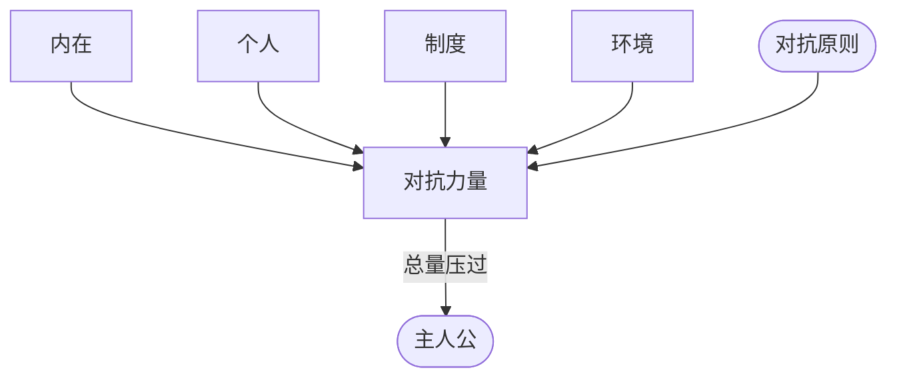

# 对抗力量（Forces of Antagonism）

> English: [[wiki/en/concepts/forces-of-antagonism|English]]

## 定义
**对抗力量**是所有与主人公（[[protagonist]]）意志与欲望相抵抗的力量的**总和**。它并不等同于具体的反派或对手，而包括内在的缺陷、与他人的个人冲突、制度压力、环境或宇宙层面的敌意。

## 麦基的论述
"对抗力量"不一定指某个具体反派。恰当类型里，伟大的大反派令人叫绝；但作者真正要对付的是对抗的**总量**。在激励事件（[[inciting-incident]]）那一刻，主人公的意志与智力、情感、社会、身体能力之和，应被对抗总量压过——让他**有机会**，但**不占优**。正是这种不对称逼迫主人公做出更真切的选择，并由此成为多维度的人物。

## 运作机制
- **跨层清点**：在每个冲突层面（[[levels-of-conflict]]）排查对抗——内在（主人公自身）、个人（亲密关系）、超个人（制度、社会、环境）。
- **相加而非集中**：力量来自**总和**。一个四面受援（制度、内在）的弱反派，会强过一个孤立的强反派。
- **沿阶梯下行**：对抗的递进来自让故事穿越价值进阶（[[value-progression]]）——矛盾、对立、否定之否定（[[negation-of-the-negation]]）——而非堆砌同质挫折。
- **先设计负向**：先建对抗，正向自会被迫回应、抬升。

## 电影案例
- **[[chinatown]]** 唐人街——Cross 是具体人物反派，但真正的力量还包括警局的腐败、洛杉矶的水权政治、Evelyn 的家族秘密、以及 Jake 自己在唐人街过往的负罪感。主人公无一层是安全的。
- **[[casablanca]]** 卡萨布兰卡——纳粹占领（制度）、Ilsa 对 Laszlo 的忠诚（个人）、Rick 的自我厌弃（内在）、中立城市同时也是陷阱（环境）：四面并进。
- **[[the-terminator]]** 终结者——除了接近完美的杀手机器，还有不肯相信 Sarah 的警方、未来战争、以及 Sarah 自己的恐惧与经验匮乏。

## 与其他概念的关系
- 受对抗原则（[[principle-of-antagonism]]）统领。
- 以价值进阶（[[value-progression]]）组织，最深处由否定之否定（[[negation-of-the-negation]]）标示。
- 分布在冲突层面（[[levels-of-conflict]]）之上。
- 为冲突法则（[[law-of-conflict]]）在每场戏里提供所必需的阻力。

## 常见错误
- 把"对抗力量"等同于单一反派。
- 只在一个层面堆砌（只有一个高大反派，无制度、无内在回应）。
- 用同质化压力加码，而不沿阶梯下行。
- 先建英雄再"等"对抗浮现。

## 来源
- 《故事》第14章（核心定义）
- 《故事》第7章（[[levels-of-conflict]]）
- 《故事》第9章（[[progressive-complications]]中的操作角色）
