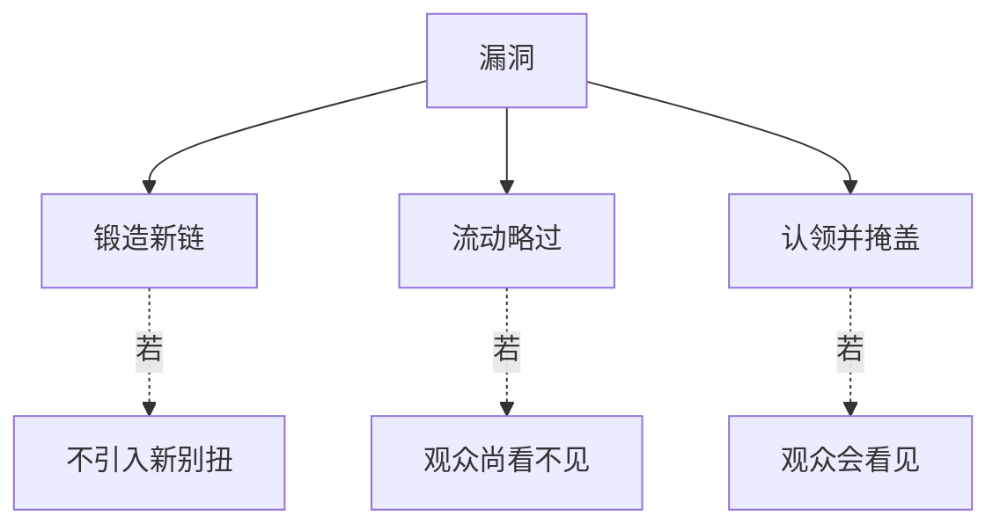

# 漏洞（Hole）

> English: [[wiki/en/concepts/hole|English]]

## 定义
**漏洞**是故事因果链上缺失的一环——逻辑上的断裂。漏洞是生活的事实，出现在各级别的影片中。问题不是彻底根除它们，而是**如何处理**留下的那些。

## 麦基的论述
一个故事在桌上静止时，漏洞会凝视着你；放到银幕上时间开始流动，观众未必有时间或信息识别它。三种策略，按优先级排序：

1. **锻造新链**。写一场能补齐漏洞的新戏——前提是**不会**带来新的别扭。
2. **凭流动略过**。若到达漏洞时观众尚无足够信息看见它，就让它顺流而过。
3. **认领并掩盖**。让主人公亲口说出漏洞，并耸肩带过，观众便会点头继续。

## 运作机制
- **以流动检验**。桌上看得见的漏洞，运动中或许看不见。**看电影**，而非**读剧本**，来下判断。
- **以口头认领**。*卡萨布兰卡*中 Ferrari 无利可图地帮助 Laszlo，然后自语："我也不知道自己为什么这么做，这对我毫无好处……" 观众点头接受。
- **用混乱筑墙**。*终结者*让 Sarah 在结尾自己说出时间悖论："想多了会疯。" 观众接受继续。
- **永远不要用巧合补洞**。方便的意外不是修补，而是第二个洞。

## 电影案例
- **[[casablanca]]** 卡萨布兰卡——Ferrari 的非人物本色的慷慨，被命名、被原谅。
- **[[the-terminator]]** 终结者——时间回路悖论被说出口再被放过。
- *唐人街*——Ida Sessions 知道一些她本不该知道的事；观众在反应过来前已被剧情带走。

## 与其他概念的关系
- 威胁真实性（[[authenticity]]）；漏洞处理方式决定观众是否能继续悬置不信。
- 与巧合（[[coincidence]]）不同；巧合是随机事件，漏洞是缺失环节。用巧合补洞只会使问题加倍。
- 经常由前置的铺垫（[[foreshadowing]]）预先给后来的漏洞提供着力点。

## 常见错误
- 在漏洞上盖沙、盼人看不见。
- 用一场新戏补洞，却带来更糟的别扭。
- 用巧合补洞。
- 忽视"纸上"与"银幕上"的差异——同一漏洞在两处的阅读截然不同。

## 来源
- 《故事》第16章
