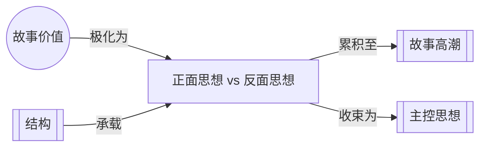

# 正面思想 vs. 反面思想（Idea vs. Counter-Idea）

> English: [[wiki/en/concepts/idea-vs-counter-idea|English]]

## 定义

递进通过在故事核心价值的正面和负面电荷之间动态移动来构建。正面思想（Idea）和它的反面思想（Counter-Idea）在序列之间来回争论，创造出戏剧化的辩证辩论。在高潮处，一方获胜，成为故事的[[controlling-idea|主控思想]]。

## 概念关系图

## 麦基的论述

从灵感的那一刻起，作者就在从前提到主控思想之间搭建一座桥梁。事件回响着同一主题的矛盾声音——同一思想的正面和负面论断贯穿全片相互竞争，强度递增，直到在危机（Crisis）处正面碰撞。从这种碰撞中升起故事高潮，其中一个思想获胜。

这种节奏是所有优秀故事的根本，无论行动多么内化。它可以变得非常复杂、微妙和充满反讽——在《激情似海》中，每个指向嫌疑人有罪的场景都带有反讽的转折：在正义的价值上是正面的，在爱情的价值上是负面的。

## 运作机制

以犯罪故事模式为例：
1. **反面思想：** "犯罪有利可图，因为罪犯太聪明了"——一桩如此神秘的犯罪，观众认为他们会逍遥法外
2. **正面思想：** "犯罪得不偿失，因为警察更聪明"——发现了一条线索
3. **反面思想：** 警察被误导——"犯罪有利可图"
4. **正面思想：** 真正的恶棍被识别——"犯罪得不偿失"
5. **反面思想：** 罪犯抓住了主人公——"犯罪有利可图"
6. **危机→高潮：** 一方决定性地获胜

## 电影案例

- **[[chinatown|唐人街]]**（*Chinatown*）— 负面的反面思想获胜："不公正盛行，因为对抗力量拥有压倒性的残忍和权力"
- **《沉默的羔羊》**（*The Silence of the Lambs*）— 正面思想获胜："正义获胜，因为主人公坚韧不拔、足智多谋、勇敢无畏"

## 与其他概念的关系

- [[controlling-idea]]（主控思想）— 辩证法中获胜的一方成为主控思想
- [[story-values]]（故事价值）— 辩证法在故事核心价值的正面和负面电荷之间摆动
- [[story-climax]]（故事高潮）— 正面思想和反面思想最后一次碰撞之处

## 常见错误

- **说教主义：** 只构建正面思想一方而削弱反面思想——故事变成了布道
- **模糊性：** 在高潮处未能让任何一方清晰获胜——反讽是清晰的双重宣言，不是模糊
- **巧合：** 通过随机偶然而非诚实的动机来解决辩证法

## 来源

- 《故事》第6章，"正面思想与反面思想"
