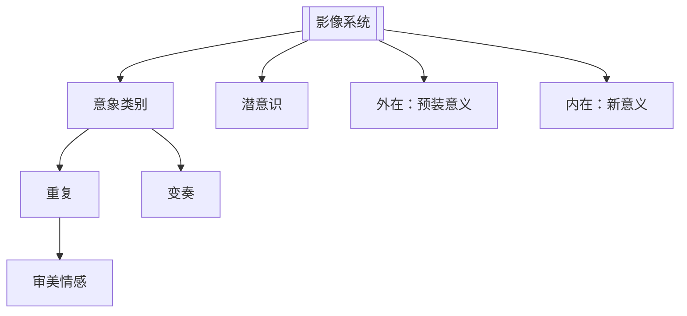

# 影像系统（Image Systems）

> English: [[wiki/en/concepts/image-systems|English]]

## 定义
**影像系统**是一整套母题策略——把一类影像嵌入影片、自始至终以视觉与声音反复出现，富有大量变奏，却同样高度**潜意识**，借此深化作品的复杂度与审美情感。

## 麦基的论述
观众对银幕上每一件物象都进行**象征性解读**——一辆汽车可以仅凭品牌与车型便立即"代表"富有、危险、艺术家。讲故事者可以利用这一直觉：把影片的意象收窄到一类具有恰当内涵的物象，再以变奏重复这一类。

两种：

- **外在影像**：一类在影片之外就已经被赋予意义（旗帜＝爱国，十字架＝宗教，蛛网＝困陷），被带入影片承担同样意义。学生片的标志。
- **内在影像**：把一类意象带入影片，**仅在本片范围内**承担全新意义。*悴红*把"水"通用的积极符号反转为死亡与恐怖；*唐人街*把"盲视"的系列（窗户、镜子、破眼镜、望远镜、摄像机）转成"恶在我们内部"的主题。

最关键：影像系统**必须潜意识**。一旦观众把它识别为"象征"，就变得中性、失效。象征的力道运作方式同音乐、梦境——只在绕过意识时起作用。

## 运作机制
- **排除 90% 的现实**。把调色板收窄到符合本片内涵的物象。
- **选取足够宽的类别**。自然维度（四季、动物、光／暗），文化维度（建筑、机器、艺术），身体母题（水、绳、眼）。
- **重复 + 变奏**。孤立符号无力；同类别的十余次变奏叠加才有效。
- **内在优于外在**。在片内创造新意义，不要引入成品意义。
- **保持潜意识**。一旦观众齐喊"象征！"系统即死（麦基的 *Viridiana* 逸闻）。
- **作家起头，美术收束**。作家在描写和对白里播种；导演与美术在制作中延展。

## 电影案例
- **[[casablanca]]** 卡萨布兰卡——三条系统：囚禁（机场探照灯、如牢栅的阴影、"escape"计划）；美国即世界（国际难民、别人把 Rick 当作一个国家来对话）；相连／相离（Rick 与 Ilsa 由构图相连；Ilsa 与 Laszlo 由构图相离）。
- **[[chinatown]]** 唐人街——四条系统：盲视（窗、镜、摄像机、破眼镜、死者未合之眼）、腐败合同（合法的罪行成为社会粘合剂）、水／旱、性的残酷／爱。
- *悴红*——"水"作为被反转的死亡符号；"最湿的影片"。
- *异形2*——"母职"系统（Ripley 作代母；异形女王是怪物式母亲；Newt 的破娃娃），由*异形*的情欲／"强奸"系统重新发明。
- *下班后*——"艺术即武器"。
- *犹在镜中*——四条系统以对位穿梭。

## 与其他概念的关系
- 与设定（[[setting]]）互动——世界的物理／社会维度是影像系统寄生之地。
- 默默承载主控思想（[[controlling-idea]]）不便明言的那部分；论证说不出的，诗学低声说。
- 通过无意识生成审美情感（[[aesthetic-emotion]]）。
- 常沿象征升格（[[symbolic-ascension]]）从字面升至原型。
- 先在描写（[[description]]）中播种。

## 常见错误
- **给象征贴标签**。人物说出、镜头停留——系统即死。
- **重复过少**。一两次没有任何作用。
- **外在影像当捷径**。旗帜、十字、蛛网——瞬间学生片。
- **把好看当诗学**。装饰性摄影不是影像系统。
- **完全推给导演**。作家若说"那是导演的事"便是放任；作家应起头。

## 来源
- 《故事》第18章
