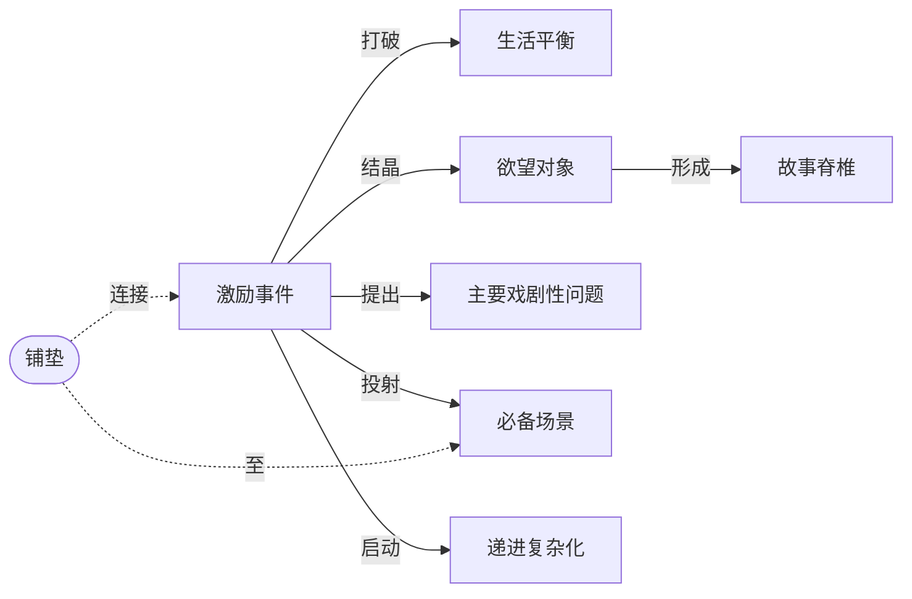

# 激励事件（Inciting Incident）

> English: [[wiki/en/concepts/inciting-incident|English]]

## 定义
**激励事件**是讲述的第一个重大事件。它**从根本上打破主人公生活中的力量平衡**，唤起他恢复平衡的欲望，促使他形成[[object-of-desire]]（欲望对象），并推动他主动追求。

## 麦基的论述
一切故事都是追寻，而激励事件是这场追寻的点火装置。它不能模糊、静止或稀释：它必须把主人公的生活决定性地推向正向或负向。它可以是偶然发生（巧合），也可以是有因的（决定——由主人公或有权影响他的人做出），此外别无他途。偶尔需要"铺垫—兑现"两幕，但兑现不能推迟太久。主情节的激励事件必须出现在**银幕上**：这是影片的"大钩子"，它提出[[major-dramatic-question]]（主要戏剧性问题），并把[[obligatory-scene]]（必备场景）投射进观众的想象。

## 运作机制
- 位置：通常在全片前25%内——尽早登场，但不得早于观众能充分反应的时刻。
- 质地：与世界相契合即可；小可以是一瞥，大可以是爆炸。
- 功能核对：是否打破平衡？是否唤起欲望？是否结晶出欲望对象？是否提出主要戏剧性问题？是否投射必备场景？
- 复杂主人公：它可能唤起一种与自觉欲望矛盾的潜意识欲望，从而确立[[spine]]（故事脊椎）。

## 电影案例
- **[[kramer-vs-kramer]]**（*克莱默夫妇*）— 克莱默太太在第2分钟抛夫弃子。原型式；无需铺垫。
- **[[jaws]]**（*大白鲨*）— 鲨鱼咬人（铺垫）→ 警长发现尸体（兑现）。两幕式设计。
- **[[ordinary-people]]**（*凡夫俗子*）— 贝丝把法式吐司刮进垃圾处理器。一个小到手势级的激励事件。
- **[[rocky]]**（*洛奇*）— 第30分钟迟到登场，兼作第一幕高潮，由爱情副情节铺垫。
- **[[chinatown]]**（*唐人街*）— 主情节激励事件延迟到来，由通奸调查副情节支撑前半段。

## 与其他概念的关系
- [[object-of-desire]]（欲望对象）— 由激励事件结晶。
- [[spine]]（故事脊椎）— 激励事件唤醒主人公最深（常为潜意识）欲望时形成。
- [[major-dramatic-question]]（主要戏剧性问题）— 观众目睹激励事件时被激起。
- [[obligatory-scene]]（必备场景）— 由激励事件投射进观众想象，经[[foreshadowing]]（铺垫）相连。
- [[progressive-complications]]（递进复杂化）— 故事躯干始于激励事件的终点。

## 常见错误
- 把激励事件放进前史或银幕之外。
- 铺垫与兑现相隔太远以至观众遗忘（参见*大河情*）。
- 将其视为必要的铺陈而非"根本打破"——麦基引发行商的笑话：好莱坞电影"开场三镜：云，747，爆炸"，而欧洲电影开场是"云，更多云，更多云"。

## 来源
- 《故事》第8章（"激励事件"）
- 《故事》第9章（"幕的设计"）——位置变体
