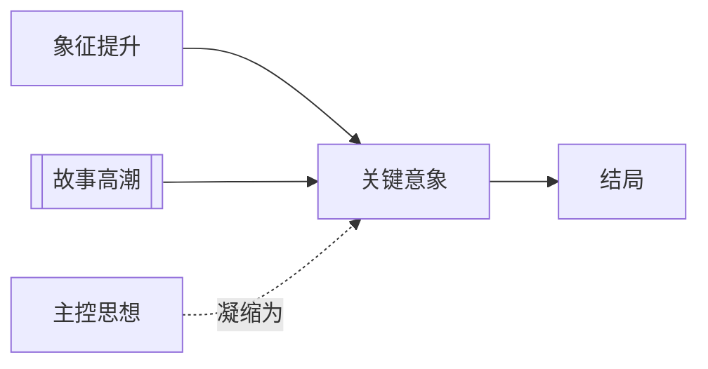

# 关键意象（Key Image）

> English: [[wiki/en/concepts/key-image|English]]

## 定义
关键意象（Key Image）是结尾处那个把故事意义与情感浓缩进单一画面的终极图像。

## 麦基的论述
借特吕弗“景观与真相”的说法，麦基认为，伟大的结尾不仅解决动作，也解决图像。关键意象就像交响乐的尾声：一旦被记起，整部作品会被它重新召回。

## 运作机制

## 电影案例
- **[[the-deer-hunter]]**（《猎鹿人》）— 山顶对峙被提升为猎人与怜悯的原型性意象。
- **[[the-terminator]]**（《终结者》）— 萨拉的最终构图把角色上升为神话性母体。
- 《贪婪》与《窃听大阴谋》则是麦基列举的经典关键意象案例。

## 与其他概念的关系
- [[story-climax]]（故事高潮）— 关键意象通常就嵌在高潮内部。
- [[controlling-idea]]（主控思想）— 图像应回响全片最深层的意义。
- [[symbolic-ascension]]（象征提升）— 关键意象的力量要靠前面的象征累积来抬高。
- [[resolution]]（结局）— 它也常常桥接高潮与余波。

## 常见错误
没有结构与主题准备的“漂亮画面”救不了结尾；它只会变成装饰。

## 来源
- 《故事》第13章

