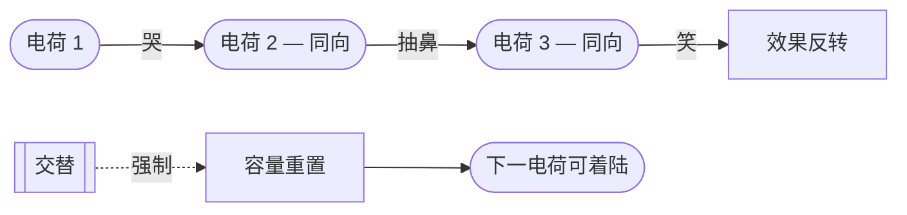

# 递减效应律（Law of Diminishing Returns）

> English: [[wiki/en/concepts/law-of-diminishing-returns|English]]

## 定义

**情感高峰即燃尽。** 同一情感电荷不能背靠背重复，否则效果会减弱、最终反转。三个悲剧场景连续摆——先哭，再抽鼻，再笑场。

## 麦基的论述

由于情感寿命短暂（高峰即燃尽），讲述者必须**让电荷交替**。同向正面情感连续推送会钝化成滥情；同向负面情感连续推送则麻木成闹剧。补救之法是在同向事件之间插入对立电荷——哪怕只是一拍——让观众的容量重置。这是[[act-rhythm|幕的节奏]]、[[unity-and-variety|统一与变化]]与[[pacing|节奏控制]]背后的引擎。

唯一的例外：**负→负可以成立，前提是后一事件糟糕到能让前一事件回看时显得正面。**《搏击俱乐部》中泰勒强迫主角直面化学灼烧的痛——第二个负面（无法逃出"会受苦的身体"这一形而上事实）灾难到让前一个负面回看像"至少还能逃避"。

## 运作机制

1. **识别下一个场景的电荷方向。** 正还是负。
2. **回看上一个同向节拍。** 如果刚刚完成同向投放，下一发会衰减。
3. **先插入相反电荷。** 副情节、对照节拍、小反转——让观众的容量重置。
4. **以情绪让必须重复的弧线"换味"。** 如果重复无法避免，就改变质地（光、乐、节奏），让电荷相同但风味不同。参[[emotion-feeling-mood|情感、感受与情绪]]。

## 电影案例

- **《教父2》**——科波拉交叉剪辑维托温情的崛起（正）与迈克尔冷酷的沉沦（负）。两种电荷都因不断被对方释放而不会燃尽。
- **《盗梦空间》**——四层高潮在结构上解决了递减效应律：每一层情绪不同（紧迫、失重的奇异、战术清晰、哀伤），因此同一个"救援"弧线四次着陆，每次都不钝化。参[[emotion-feeling-mood|情感、感受与情绪]]。
- **《蝙蝠侠：黑暗骑士》**——*瑞秋/哈维*段落。负→负之所以成立，是因为小丑揭露蝙蝠侠只能救一人，灾难性到让先前的负面相对显得可承受。

## 与其他概念的关系

- 是[[act-rhythm|幕的节奏]]的节拍约束（没有两个幕高潮可以重复前一幕的电荷）。
- 在场景-序列层面驱动[[unity-and-variety|统一与变化]]。
- 解释为什么[[melodrama|情节剧]]显得空洞：它堆叠同向电荷而不交替。
- 是交叉剪辑与[[subplot|副情节]]存在的理由：交替是结构装置，不只是风格选择。
- 没有交替，[[meaning-produces-emotion|高潮处的意义]]就着不了陆——容量已被烧光。

## 常见错误

- **堆叠煽情。** 连续三个"催泪点"。
- **堆叠动作。** 连续四场追逐——第三场使人厌倦，第四场令人发笑。
- **把音量误当电荷。** 大声不等于"新一发"。重置依赖情绪切换，不是振幅。
- **忽视"负→负"的例外。** 机械避免重复会把一些有意识的降级（如《梦之安魂曲》）拍平。

## 来源
- 《故事》第13章（情感即价值转变）
- `sources/supplementary/Emotion, feeling, and mood in screenwriting.html`
