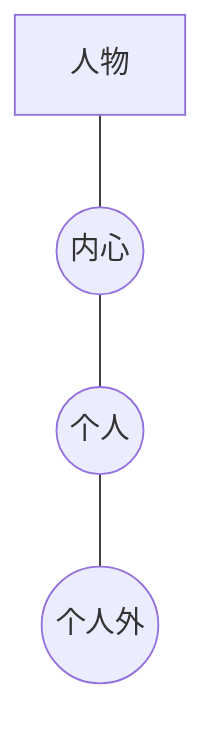

# 冲突的三个层次（Levels of Conflict）

> English: [[wiki/en/concepts/levels-of-conflict|English]]

## 定义
人物的世界由三圈同心圆的对抗构成——**冲突的三个层次**：
1. **内心冲突**（Inner Conflict）— 心智、身体、情感的自我交战。
2. **个人冲突**（Personal Conflict）— 亲密关系（家人、朋友、爱人）——深过社会角色。
3. **个人外冲突**（Extra-personal Conflict）— 社会机构、其他社会角色中的个体、人造或自然环境。

## 麦基的论述
每一道[[the-gap]]（鸿沟）都在这些层次之一或多个上裂开。只在单一层次运转的故事属于**复杂化**（动作片、肥皂剧、意识流）。让冲突在三个层次上同时展开的故事才获得**复杂性**。一生中冲突的总量恒定——变化的只是层次，"就像挤压一只气球"。

## 电影案例
- **[[kramer-vs-kramer]]**（*克莱默夫妇*）— 法式吐司场景三层并进。
- *007系列* — 几乎只在个人外层面。
- *肥皂剧* — 几乎只在个人层面。

## 与其他概念的关系
- [[the-gap]]（鸿沟）— 在这些层次上裂开。
- [[law-of-conflict]]（冲突法则）— 驱动它们的原理。
- [[complication-vs-complexity]]（复杂化与复杂性）— 取舍其中的设计选择。
- [[setting]]（背景）— "冲突层次"是其四维度之一。

## 常见错误
- 只写"外部"障碍，内心与个人层面毫无触动。
- 把冲突的**数量**误当作层次的**跨度**。

## 来源
- 《故事》第7章（定义）；第9章（复杂化与复杂性）
