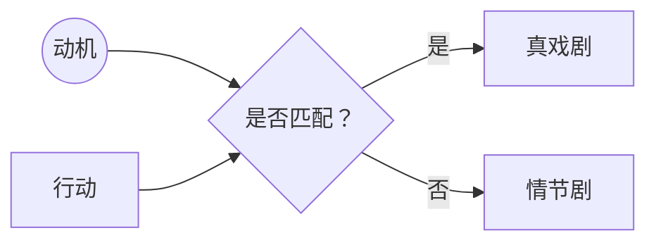

# 情节剧（Melodrama）

> English: [[wiki/en/concepts/melodrama|English]]

## 定义
**情节剧**是当一次行动的动机小于其表达时产生的效果。不是"写得太大"，而是"欲望太小"。解决之道不在缩小场景，而在加深其背后的力量。

## 麦基的论述
人类所做之事**本身**并不情节剧化——每日新闻都在记录圣徒式的自我牺牲与怪物式的残忍。一个场景让人觉得情节剧化，是因为观众不相信**动机能匹配行动**。莎士比亚与伯格曼能演出极端场景而不沦为情节剧，是因为他们先演出了极端的动机。"若你能想象高戏剧或高喜剧，就去写；但要把驱动人物的力量抬升至与其行动极端相匹甚至更高。"

## 运作机制
- **向上诊断**。若场景被读作情节剧，不要缩小表达，去审计动机。
- **先构建对抗力量**。被压倒性对抗驱动的人物，自会赚来极端的行动。
- **不要退回极简**。写"小事小情"以回避情节剧只会得到空洞的速写，读作不诚恳。
- **记住冲突法则**（[[law-of-conflict]]）。动机之下的阻力让规模不会坍塌为奇观。

## 电影案例
- *李尔王*——风暴场景与世界同大，动机更大；毫无情节剧。
- *呼喊与细语*——极端情感，由数十年的潜文本与关系史挣来。
- 任何只堆砌苦难而未赚来苦难的苦情片——反例。

## 与其他概念的关系
- 由强对抗力量（[[forces-of-antagonism]]）与对抗原则（[[principle-of-antagonism]]）阻止。
- 反向违反戏剧化而非讲述（[[dramatize-dont-explain]]）：场景**戏剧化了**，但缺少支撑其合法性的隐性动机。
- 与冲突法则（[[law-of-conflict]]）执行不足紧密相关。

## 常见错误
- 写得小以示细腻，其实是潜在的赌注就小。
- 加眼泪、加喊叫、加暴力以"提升"一个未被抬升动机的场景。
- 把情节剧误当作一种类型；它是技艺失败，不是类别。

## 来源
- 《故事》第16章
