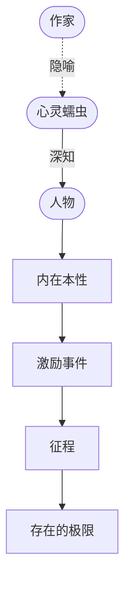

# 心灵蠕虫（Mind Worm）

> English: [[wiki/en/concepts/mind-worm|English]]

## 定义
**心灵蠕虫**是麦基借用的一个中世纪意象，用来描述作家的工作本身：一种能钻进人的心智、完整了解其梦想、恐惧、优劣的生物；在把一个人读透之后，它在世界上制造**专属于他**的单一事件——那个事件会迫使他把自己用到极限。作家就是心灵蠕虫；他所设计的事件就是激励事件（[[inciting-incident]]）。

## 麦基的论述
中世纪学者用诗化密码进行思考。心灵蠕虫是他们思考心理学的方式：设想一种生物能够彻底了解一个人，然后为他"量身定制"经验。对一位主人公，这个事件可能是得到一笔财富；对另一位，则是失去财富。"像心灵蠕虫一样，我们以诗化密码探索人性的内景。"

## 运作机制
- **先认识人物**。他希望什么、恐惧什么、藏了什么、意识／无意识各想要什么。
- **为他设计事件**。设计一个**只能**撬动他、而非任一泛泛主人公的激励事件。
- **事件对应弧光**。事件施加的压力应恰好把他推向你想揭示的维度（[[character-dimension]]）。
- **保留神秘**。心灵蠕虫全知，但纸上不必全说；一旦事件启动，动机不必过度解释。

## 电影案例
- *大审判*——把酗酒律师安排到可能让他救赎或毁灭的那一个案件上。
- *洛基*——把小拳手送到能让他无意识的自尊欲浮出水面的那一场比赛上。
- *克莱默夫妇*——把工作狂推到一个儿子和一个出走的妻子面前。
- *教父*——把拒绝家族事业的儿子放在那件**只有它**能把他拖回家的事件之上。

## 与其他概念的关系
- 在技艺层面转化为激励事件（[[inciting-incident]]）。
- 起点是对主人公（[[protagonist]]）及其待揭示维度（[[character-dimension]]）的认识。
- 设定主人公接下来将追逐的欲望对象（[[object-of-desire]]）与故事脊椎（[[spine]]）。

## 常见错误
- 把激励事件写成泛泛扰动（一场死亡、一次背叛），而非**只有这位**主人公无法拒绝的那一件事。
- 对动机说得太清，人物随之变小——心灵蠕虫"知道"，但作家在纸面上留下神秘。

## 来源
- 《故事》第17章
