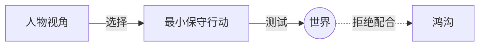

# 最小保守行动（Minimum Conservative Action）

> English: [[wiki/en/concepts/minimum-conservative-action|English]]

## 定义
任何时刻，任何人物——包括主人公——都会**从自己的视角**采取**最小的、保守的行动**：他所相信的、能从世界激起所需反应的、代价最低的行动。

## 麦基的论述
人性根本上是保守的，自然亦然：没有生物消耗比必要更多的能量。从外看似极端的行动，从内看往往是最小的（功夫片英雄一脚踹门）。这在结构上至关重要：[[the-gap]]（鸿沟）正是针对这最小预期而被定义的——只有当世界拒绝最小行动时，故事才开始。

## 电影案例
- *唐人街* — 吉蒂斯先以电话威胁报警；伊芙琳抗拒后才升级到暴力。

## 与其他概念的关系
- [[the-gap]]（鸿沟）— 鸿沟即对最小预期的违背。
- [[protagonist]]（主人公）— 必须在自身视角中合理地做最小选择。

## 常见错误
- 人物无动机地跳向极端行动。
- 用客观视角写作（"这人物应当做什么？"）而非主观（"**如果我是**这个人物，我会怎么做？"）。

## 来源
- 《故事》第7章"第一步"一节
