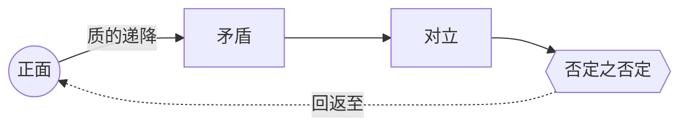

# 否定之否定（Negation of the Negation）

> English: [[wiki/en/concepts/negation-of-the-negation|English]]

## 定义
**否定之否定**是处于人类体验极限的复合负面——一种在质上比"正向的对立面"更糟的状态。算术里两个负数相消；生活里它们叠加。否定之否定就是"越来越糟、越来越糟、越来越糟"，直至故事触底。

## 麦基的论述
每个故事都围绕一个核心价值运转。在正向与其对立面之间，存在不同程度的黑暗。**矛盾**（Contrary）带负面但未完全对立（不公 vs. 正义）；**对立**（Contradictory）是正面的直接反面（不义）；**否定之否定**则是**质上不同**的糟糕——价值所依附的框架本身被败坏。不义可以被惩罚，**暴政**让正义无处可得；谎言遮蔽真相，**自欺**让真相失去可能。

停在对立之前的故事可以令人满意；唯有抵达否定之否定，才会崇高。"在其他因素相当的前提下，伟大就在于作家对负面一侧的处理。"

## 运作机制
- **先命名中心价值**（正义、爱、真相、自由、成熟、财富、忠诚、意识、沟通、理想、智慧、勇气、受许可的自然性行为……）。
- **绘制四站**，而非两站：正面 → 矛盾 → 对立 → 否定之否定。
- **递降是质变，非量变**。找到那种让价值框架本身被败坏的形态。
  - *正义 → 不公 → 不义 → 暴政（以力代法）*
  - *爱 → 冷漠 → 仇恨 → 自我厌恶*
  - *真相 → 善意谎言 → 谎言 → 自欺*
  - *自由 → 约束 → 奴役 → 自我奴役／把奴役视作自由*
  - *勇气 → 恐惧 → 怯懦 → 伪装成勇气的怯懦*
- **务必在某处抵达**。典型进阶是：第一幕正面至矛盾，中后幕至对立，末幕至否定之否定。也有故事反向：*卡萨布兰卡*开场即处于否定之否定，然后一路回升；*飞越未来*直接跳至否定之否定，再照亮每一层灰度。

## 电影案例
- **[[chinatown]]** 唐人街——"受许可的自然性行为"的极限不是乱伦（那只是对立），而是与乱伦所生后代再度乱伦。这正是反派无可抹除的原因。
- **[[casablanca]]** 卡萨布兰卡——在自由（法西斯暴政）、爱（Rick 的自我厌弃）、真相（自我欺骗）三条价值线上，都从否定之否定起步，最终攀回正面。
- *满洲候选人*——由意识降至无意识、被操控，再至受诅咒：被他人操纵后意识到自己的所为，自我因此被毁。
- *凡夫俗子* / *闪亮的风采*——父母对子女的憎恨伪装成爱：爱之否定之否定。

## 与其他概念的关系
- 价值进阶（[[value-progression]]）的终极站点。
- 对抗原则（[[principle-of-antagonism]]）要求对抗力量（[[forces-of-antagonism]]）抵达的深度。
- 放大危机处的两难（[[dilemma]]）——负向框架越深，选择越不可调和。
- 赋予主控思想（[[controlling-idea]]）真正的重量：唯有触底的故事，才能说出超越性的意义。

## 常见错误
- 把"对立面"当作极限——不义只是对立，不是底。
- 机械反转（堆同质负面）而非质变。
- 抽象抵达而未具体戏剧化。
- 对其呈现时间过短，观众来不及感受到下降。

## 来源
- 《故事》第14章
