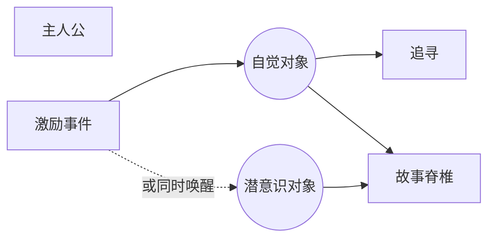

# 欲望对象（Object of Desire）

> English: [[wiki/en/concepts/object-of-desire|English]]

## 定义
**欲望对象**是主人公觉得自己所缺、所需以恢复生活平衡之物——是他追寻的物质、情境或态度目标。可以是外在的（《大白鲨》里毁灭鲨鱼）、内在的（《飞进未来》的成熟），也可以是精神的（*温柔的怜悯*里意义丰盈的人生）。

## 麦基的论述
要把握任何故事的"追寻"形式，只需指认主人公的欲望对象。深入其心理，诚实回答："他想要什么？"复杂主人公拥有两个对象：**自觉的**一个与**潜意识的、互相矛盾的**另一个。最深的那个——只有一个时即是自觉对象，两者并存时即是潜意识对象——成为[[spine]]（故事脊椎）。

## 电影案例
- **[[jaws]]**（*大白鲨*）— 免于鲨鱼威胁的安全。
- *飞进未来* — 成熟。
- *月色撩人* — 一个可以相爱的人。
- *温柔的怜悯* — 有意义的人生。

## 与其他概念的关系
- [[inciting-incident]]（激励事件）— 结晶出欲望对象。
- [[spine]]（故事脊椎）— 最深的对象即脊椎。
- [[the-quest]]（追寻）— 由所追对象定义。
- [[protagonist]]（主人公）— 必须（自觉地）知道自己想要什么。

## 常见错误
- 模糊或飘移的对象，使观众无从追踪"他想要什么？"
- 潜意识对象只是自觉对象的同义词。

## 来源
- 《故事》第7、8章
