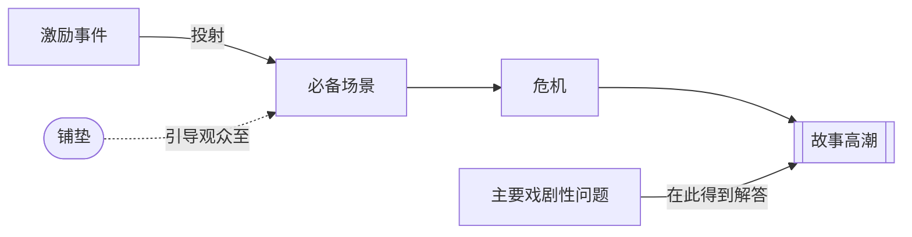

# 必备场景（Obligatory Scene）

> English: [[wiki/en/concepts/obligatory-scene|English]]

## 定义
**必备场景**是观众凭直觉知道故事结束前必须出现的那一场。到第13章时，麦基进一步澄清：它通常就是[[crisis|危机（Crisis）]]——主人公在最终行动前必须面对的最后决定场。

## 麦基的论述
动作类型会非常鲜明地把必备场景投射出来；更内在的类型则会慢慢显影。不管哪一种，它都意味着欲望与最强敌对力量的承诺性会合。后续章节让这个概念更清楚：它最深的功能不只是对决，而是选择。

## 电影案例
- **[[jaws]]**（*大白鲨*）— 警长与鲨鱼的海上正面对决。
- **[[tender-mercies]]**（*温柔的怜悯*）— 麦克女儿的死检验他刚建立的脆弱人生。
- *凡夫俗子* — 卡尔文最终以真相直面贝丝。

## 与其他概念的关系
- [[inciting-incident]]（激励事件）— 投射此场景。
- [[foreshadowing]]（铺垫）— 二者之间的联结。
- [[crisis]]（危机）— 必备场景通常在这里结晶为最终抉择。
- [[story-climax]]（故事高潮）— 在此做出的决定会引爆高潮。
- [[major-dramatic-question]]（主要戏剧性问题）— 在必备场景/高潮处得到裁决。

## 常见错误
- 把必备场景放到银幕之外或以他人转述（麦基："路人拿着望远镜，看警长和鲨鱼在远处搏斗"）。
- 未能把对抗升级到足以令这场对决显得"必然"。

## 来源
- 《故事》第8、13章
