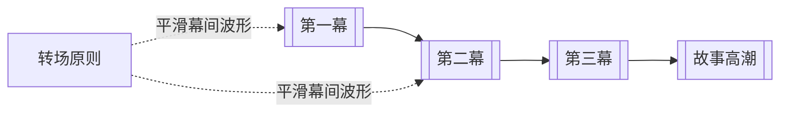

# 节奏控制（Pacing）

> English: [[wiki/en/concepts/pacing|English]]

## 定义
节奏控制（Pacing）是对整部故事中“紧—松—再紧”波形的塑造，让张力不会把观众提前耗尽，也不会提不起劲。

## 麦基的论述
麦基认为，故事应当像生活那样呼吸，而不是只会单线加压。若张力只升不降，观众会在结尾前耗空；若一路松弛，故事又会瘫软。好的节奏控制，是让强度有起伏，从而把高潮的力量保存到最后。

## 运作机制

## 电影案例
- **[[tender-mercies]]**（《温柔的慈悲》）— 以非常柔和的方式完成收紧与放松。
- **[[casablanca]]**（《卡萨布兰卡》）— 用幽默与爱情气口，让政治与情感压力不至于把观众压扁。

## 与其他概念的关系
- [[act-rhythm]]（幕的节奏）— 节奏控制在宏观层面表现为幕与幕之间的波形。
- [[scene]]（场景）— 场景的排列与时长共同塑造速度感。
- [[story-climax]]（故事高潮）— 节奏控制最终是为结尾的爆发储能。
- [[principle-of-transition]]（转场原则）— 转场帮助观众顺畅地乘上这些波浪。

## 常见错误
“事件更多”不等于“节奏更快”。节奏控制的核心不是数量，而是强弱的调度。

## 来源
- 《故事》第12章

