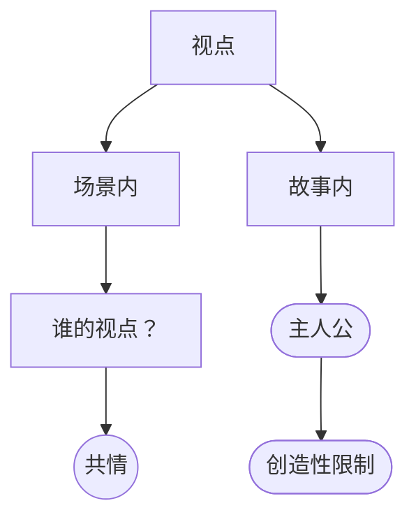

# 视点（Point of View）

> English: [[wiki/en/concepts/point-of-view|English]]

## 定义
在编剧中，**视点**有两层含义。（1）**场景内**：想象与描述事件所处的空间位置，决定共情与情感的落点；（2）**故事内**：作者自律地选择整部影片跟随谁的经验——通常是主人公（[[protagonist]]）。

## 麦基的论述
视点是一种创造性纪律，不是镜头批注。讲故事的简便之路是穿越时空跳跃取景，随处捡拾信息；结果是一个散漫、失去张力的故事。以主人公的唯一视点贯穿全片——观众只在主人公遇到事件时才遇到事件——要难得多，却造就更紧凑、更难忘的人物与影片。

在场景内，把想象放在哪里（放在 Jack、放在 Tony、交替、或中立），决定共情落在谁身上。

## 运作机制
- **故事层面**：默认采取主人公的唯一视点。观众只看主人公所看到的。偏离必须是自觉选择（惊悚片让观众看杀手视角；多线叙事）。
- **场景层面**：选择跟随谁的反应。以父子对峙为例有四种典型：
  - 紧跟 A——观众与 A 共情。
  - 紧跟 B——观众与 B 共情。
  - 交替——观众注意力一分为二。
  - 中立／侧面——观众对二人同时失去共情，可能发笑。
- **把视点当作创造性限制**。与类型惯例、主控思想一样，约束视点会逼出更深的发明。
- **与某角色共处时间越长，见证其选择的机会越多**。共情积累，深度积累。

## 电影案例
- *出租车司机*——对 Travis 视点的极端忠诚；观众被困在他的滑坠之中。
- *唐人街*——观众只知道 Gittes 所知；关键揭示都是他的发现。
- *罗生门*——故意轮转视点；回报是认识论的，而非共情的。

## 与其他概念的关系
- 通过让观众与主人公同行，集中善的中心（[[center-of-good]]）。
- 是创造性限制（[[creative-limitation]]）的一种——自我设限以逼出更好的技艺。
- 与剧本中的"POV 镜头"标注不同，不要混淆。

## 常见错误
- 浮动视点被用于掩盖缺失的场景或懒惰的铺陈。
- 为次要情节临时破坏主人公视点，却没有为额外视野付出带宽代价。
- 把视点当作分镜表，而非想象的纪律。

## 来源
- 《故事》第16章
