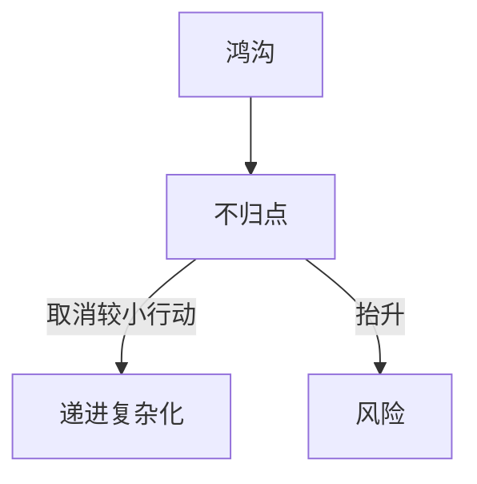

# 不归点（Points of No Return）

> English: [[wiki/en/concepts/points-of-no-return|English]]

## 定义
**不归点**是每一道鸿沟的结构性后果：当[[the-gap]]（鸿沟）裂开，观众便意识到"小规模的努力已经不行了"，该量级的行动从故事的备选库中被永久取消。

## 麦基的论述
故事的递进不能回退。每一道鸿沟都向观众宣告"那招再也不灵了"，下一次行动就必须调动更强的意志与更大的[[risk]]（风险）。若重大行动失败后，故事还给主人公安排一次小动作，观众的信任便崩塌——直觉知道，更大的尝试都败了，更小的不可能成功。

## 电影案例
- 任何[[archplot]]（大情节）— 每个幕高潮是一次重大不归点；每个序列高潮是中等不归点。

## 与其他概念的关系
- [[the-gap]]（鸿沟）— 每道鸿沟造成一次不归点。
- [[progressive-complications]]（递进复杂化）— 不归点的序列。
- [[risk]]（风险）— 每越过一次便升高。

## 常见错误
- 重大行动失败后又写一次小行动。
- 未让观众感到较小手段已**被取消**。

## 来源
- 《故事》第9章（"幕的设计"）
