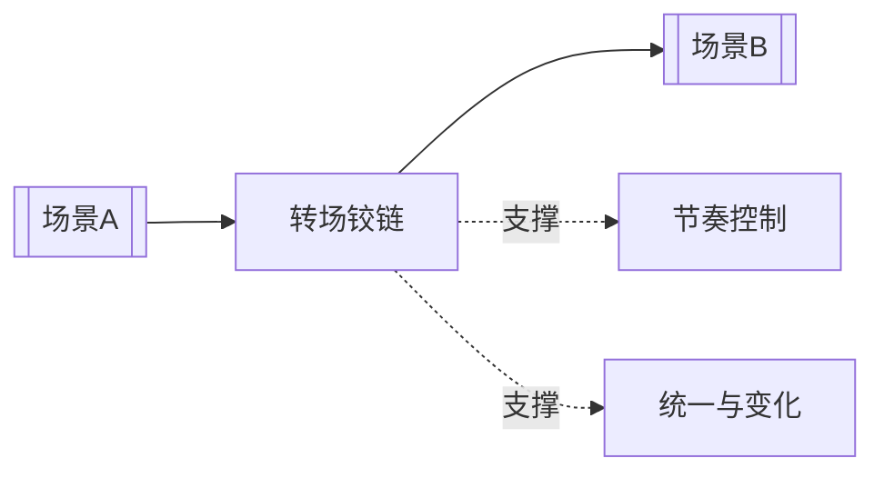

# 转场原则（Principle of Transition）

> English: [[wiki/en/concepts/principle-of-transition|English]]

## 定义
转场原则（Principle of Transition）是指用一个“铰链”把前一个场景和后一个场景接起来：这个铰链可以是共同点，也可以是对立点。

## 麦基的论述
没有转场，故事就会一场一场地踉跄前行。麦基因此强调，在两个场景之间还需要第三元素：一个共享的词、动作、物件、声音、光线、性格特征或观念。它既可以制造连续，也可以制造反差，但都能让推进更有表达力。

## 运作机制

## 电影案例
- **[[casablanca]]**（《卡萨布兰卡》）— 爱情、政治与表演不断通过细密转场编织在一起。
- **[[chinatown]]**（《唐人街》）— 对照、重复与母题让调查线穿越不同调性时仍保持连贯。

## 与其他概念的关系
- [[scene]]（场景）— 转场发生在场景之间，而不是场景内部。
- [[sequence]]（序列）— 好的转场让序列真正累积起来。
- [[pacing]]（节奏控制）— 转场帮助观众顺利穿越强弱变化。
- [[unity-and-variety]]（统一与变化）— 它在允许变化的同时保住整体连贯。

## 常见错误
机械转场也许能移动情节，却移动不了观众。最好的铰链往往同时携带意义、情绪或反讽。

## 来源
- 《故事》第12章

