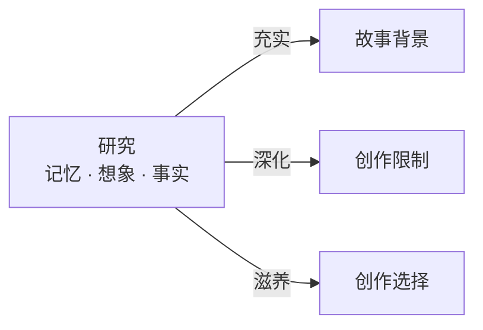

# 研究（Research）

> English: [[wiki/en/concepts/research|English]]

## 定义

研究是系统性地获取关于故事世界的知识。麦基确定了三种方法：**记忆研究**（挖掘个人经验）、**想象研究**（对角色生活的生动假设性探索）、**事实研究**（图书馆和实地调查）。一个故事通常需要这三种方法全部运用。

## 概念关系图

## 麦基的论述

研究是赢得对抗陈词滥调之战的关键。缺乏对故事世界深刻了解的作者，不可避免地会回收利用其他作品的素材。更实际地说，研究也是治愈写作障碍的良药："你写不出来，是因为你无话可说。你的才华没有抛弃你……你杀不死你的才华，但你可以用无知把它饿成昏迷。"

麦基警告说，研究绝不能变成拖延。它是"喂养想象和创造这两头野兽的肉，绝不是目的本身"。创作和研究是交替进行的——它们不是先后顺序的阶段，而是一个交替的过程。故事似乎"自己在写自己"的那个时刻，不过是作者的知识达到饱和点的标志。

## 运作机制

1. **记忆** — 自问："在我的个人经历中，有什么与角色的生活相关？"以生动的细节重温过去的经历，并*写下来*。"在你的头脑中，它只是记忆，但写下来之后，它就变成了工作知识。"
2. **想象** — 自问："如果我逐时逐日地过我角色的生活，会是什么样？"勾画那些可能永远不会出现在故事中的场景——购物、祈祷、做爱——但它们能将你拉入想象的世界，直到产生似曾相识的感觉。
3. **事实** — 去图书馆。阅读与你故事领域相关的权威著作。两件事会发生：（a）你的个人经历被证实是普遍的，意味着你会有观众；（b）你的知识超越了有限的经验圈，获得强有力的新洞见。

## 电影案例

<!-- TODO: 添加电影案例——麦基用假设的心理惊悚片情节（精神科医生和病人）来说明研究和创作如何交替进行 -->

## 与其他概念的关系

- [[setting]]（故事背景）— 研究是作者真正了解背景的手段
- [[creative-limitation]]（创作限制）— 深入研究使小世界变得丰富而非单薄
- [[creative-choices]]（创作选择）— 研究为创作筛选所依赖的超量创作提供养料

## 常见错误

- 相信仅凭日常经验就对某个主题了解得够多
- 让研究变成拖延——花数年时间研究却从不动笔
- 将研究视为信息收集，而非事件创作的素材
- 把洞见留在脑中而不写下来

## 来源

- 《故事》第3章，"研究"
