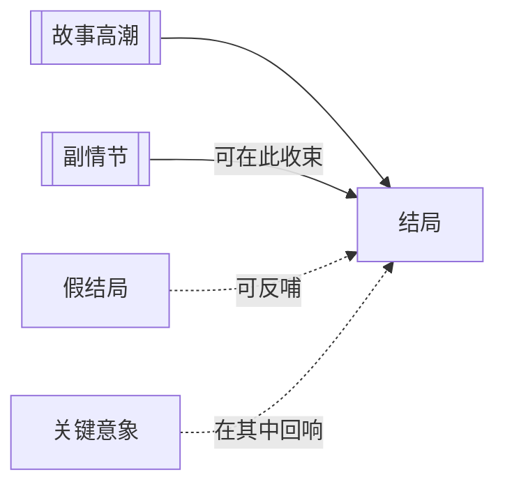

# 结局（Resolution）

> English: [[wiki/en/concepts/resolution|English]]

## 定义
结局（Resolution）是[[story-climax|故事高潮]]之后剩余的一切材料：它负责把还在晃动的东西安放下来。

## 麦基的论述
麦基给结局安排了三项工作：为遗留的[[subplot|副情节]]收口、把高潮的影响扩散到更大的社会层面、并给观众一个礼貌性的缓冲，不至于在情绪最高点被突然赶出影院。它不是多余尾巴，而是高潮之后可控的余震。

## 运作机制

## 电影案例
- **[[casablanca]]**（《卡萨布兰卡》）— 机场一场把爱情、政治与雷诺的转变一并收束。
- **[[the-empire-strikes-back]]**（《帝国反击战》）— 结尾没有结束战争，却让情绪冲击得到暂时安放，同时推向下一部。

## 与其他概念的关系
- [[story-climax]]（故事高潮）— 结局跟在不可逆转之后。
- [[subplot]]（副情节）— 次要故事线可能需要在这里完成最后一步。
- [[false-ending]]（假结局）— 有些作品会在结局里短暂拉回主线张力。
- [[key-image]]（关键意象）— 最终图像的回声常停留在结局之中。

## 常见错误
如果结局引入了无关材料，它会抽干高潮；如果完全没有结局，观众又会带着没安放好的情绪离场。

## 来源
- 《故事》第13章

