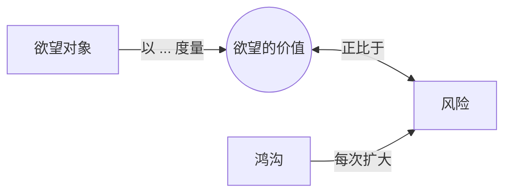

# 风险（Risk）

> English: [[wiki/en/concepts/risk|English]]

## 定义
**风险**是主人公在追求欲望时所可能失去之物。麦基的铁律：*一个人物欲望的价值与他愿为之冒的风险成正比；价值越大，风险越大。*

## 麦基的论述
检验任何故事的一条简法：风险是什么？如果主人公得不到所求，最坏会发生什么？若答案是"生活回到正常"，故事便在根上失败。有意义的人生是永处风险的人生；故事正是这种人生的隐喻。

## 电影案例
- 任何[[archplot]]（大情节）— 赌注随每个幕高潮可见地抬升。

## 与其他概念的关系
- [[the-gap]]（鸿沟）— 每道鸿沟抬升风险。
- [[object-of-desire]]（欲望对象）— 其价值由风险度量。
- [[progressive-complications]]（递进复杂化）— 风险的结构性升级。

## 常见错误
- 低赌注剧本："回到正常生活"即是满意结局。
- 忘记内心风险（灵魂、身份）可与外在风险等值。

## 来源
- 《故事》第7章"论风险"一节
