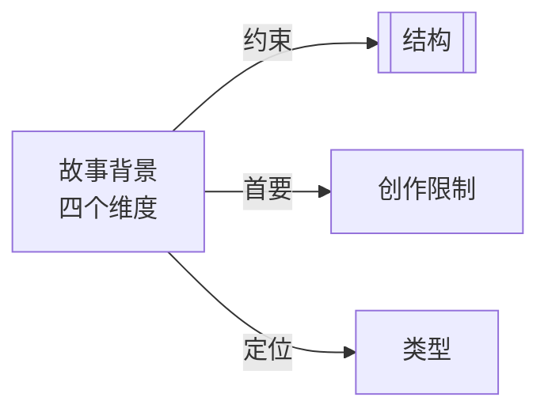

# 故事背景（Setting）

> English: [[wiki/en/concepts/setting|English]]

## 定义

故事的背景是四维的：**时代**（Period，故事在时间中的位置）、**时长**（Duration，故事跨越的时间长度）、**地点**（Location，故事在空间中的位置）、**冲突层面**（Level of Conflict，故事在人类斗争层级中的位置——从内心/潜意识冲突，到个人冲突、制度冲突，直至环境冲突）。

## 概念关系图

## 麦基的论述

背景不仅仅是布景——它是决定故事中哪些事件可能发生的基础。每个虚构世界都创造了自己的宇宙观，拥有自己关于事物如何以及为何发生的"法则"。一旦这些因果原则被建立，作者便与观众签订了一份契约：违反内部法则，观众就会拒绝接受这部作品，认为它不合逻辑。

麦基坚持"根本不存在可移植的故事"。路易斯安那河口的离婚与公园大道的离婚截然不同，与爱达荷州土豆农场的离婚更是天壤之别。拒绝在背景上具体化的作者——声称故事可以发生在任何地方——注定会写出陈词滥调，因为模糊性阻碍了产生原创性所需的深入知识。

## 运作机制

1. **时代** — 决定历史、文化和技术语境。当代？历史？假想的未来？
2. **时长** — 故事在角色生命中跨越的时间。数十年？还是一顿晚餐的时间（如《与安德烈共进晚餐》）？
3. **地点** — 具体的物理地理：哪座城市、哪条街道、哪个房间。
4. **冲突层面** — 社会/人类维度。内心的心理冲突？个人关系？与制度的斗争？与自然或宇宙的对抗？

作者必须具体定义所有四个维度，然后研究那个世界，直到拥有"统领性的知识"——深入了解每一个相关细节，以至于没有关于这个世界的问题能够难倒他。

## 电影案例

- **《奇爱博士》**（*Dr. Strangelove*）— 仅限三个场景和八个角色，故事高潮却是全球核毁灭。证明小而可知的世界可以承载最大的赌注。
- **《罪与罚》** — 麦基称之为"微观的"——一个紧密聚焦的世界，通过限制实现非凡的深度。
- **《战争与和平》** — 尽管以动荡的俄国为宏大背景，实际上仍是少数几个角色及其相关家族的聚焦故事。

## 与其他概念的关系

- [[structure]]（结构）— 背景约束结构；在给定的世界中只有某些事件是可能的
- [[creative-limitation]]（创作限制）— 背景是作者面对的第一个也是最根本的创作限制
- [[genre]]（类型）— 类型进一步定义和限制背景的可能性

## 常见错误

- 拒绝具体化（"故事设在美国"——但是*哪个*美国？）
- 假设故事是"可移植的"，可以在任何地点发生
- 构建一个过于庞大以至于无法真正了解的世界，导致表面化处理和陈词滥调
- 在建立虚构世界的内部法则后又违反它们

## 来源

- 《故事》第3章，"结构与背景"
