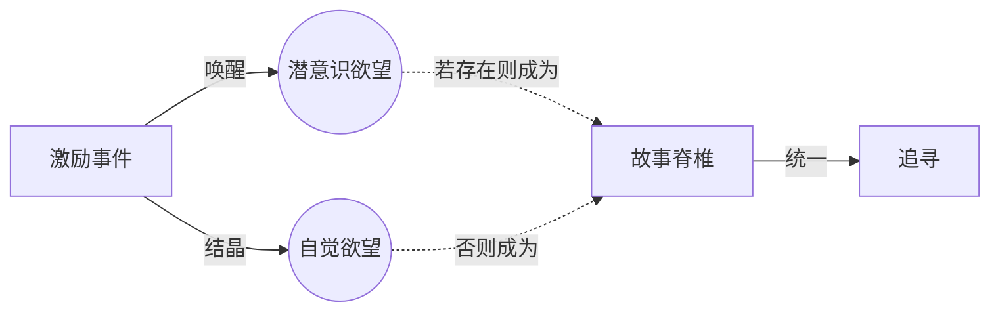

# 故事脊椎（Spine）

> English: [[wiki/en/concepts/spine|English]]

## 定义
**故事脊椎**（亦称贯穿线/Through-line，超级目标/Super-objective）是主人公恢复生活平衡的深层欲望与努力。它是贯穿一切场景、影像和语词的首要统一力量。

## 麦基的论述
若主人公只有自觉欲望，则该欲望即成脊椎（如任意邦德片：*击败大反派*）。若主人公还有**潜意识**欲望，则潜意识欲望成为脊椎：它更强大、更持久，允许作家改变角色的表层目标而不折断故事。《欲海情魔》的乔纳森自觉追求"完美女人"；其潜意识脊椎却是羞辱并摧毁女人。

## 电影案例
- *白鲸* — 以实玛利潜意识里渴望直面他在亚哈身上看到的毁灭性执念。
- *哭泣游戏* — 弗格斯潜意识里需要爱与被爱。
- *索菲尔夫人* — 她潜意识追求的是超越性的浪漫体验。

## 与其他概念的关系
- [[object-of-desire]]（欲望对象）— 脊椎即**最深**的欲望对象。
- [[inciting-incident]]（激励事件）— 唤醒脊椎。
- [[the-quest]]（追寻）— 脊椎界定追寻的轨迹。
- [[protagonist]]（主人公）— 脊椎属于主人公（或复数主人公）。

## 常见错误
- 把自觉目标的变动误解为没有脊椎。
- 给主人公设计一个与自觉欲望相同的"潜意识欲望"——这是冗余设计。

## 来源
- 《故事》第8章（"激励事件"）
