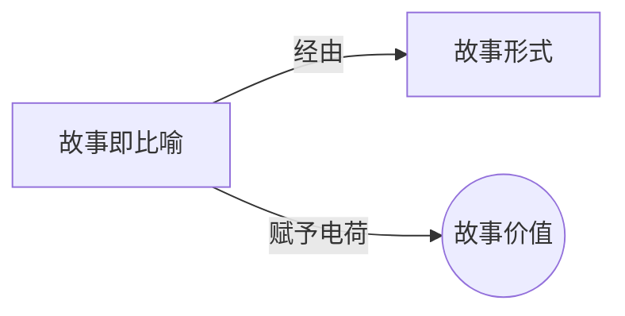

# 故事即比喻（Story as Metaphor）

> English: [[wiki/en/concepts/story-as-metaphor|English]]

## 定义

故事是生活的比喻（Story is metaphor for life）。讲故事的人是生活的诗人，一位将日常生活——内心世界和外在世界、梦想和现实——转化为以事件而非文字为韵脚的诗篇的艺术家。一个故事在说："生活就是*这样的*！"

## 概念关系图

## 麦基的论述

麦基认为故事占据了原始事实与纯粹抽象之间的独特位置。写"肖像画"（写实主义切片）的作者将逼真误认为真实，相信对日常事实的精确观察就等于讲述真相。但"事实，无论观察得多么细致入微，也只是小写't'的真实。大写'T'的真实隐藏在事物表面的背后、彼岸、内部和底层。"写"奇观"的作者将动感误认为娱乐，希望令人眼花缭乱的视觉效果能够不依赖故事而使观众兴奋。

这两种极端都失败了，因为它们误解了故事与生活的关系。故事必须从生活中提炼出本质，但不能变成一种失去所有生活感受的抽象。它必须*像*生活，而不是逐字逐句的报道。

## 运作机制

编剧必须平衡两极：以敏锐感知力观察生活的感官力量（感知）和将观众提升到超越现实之上的想象力量（想象）。事实是中性的——"将任何东西纳入故事的最弱理由是：'但它确实发生过。'"抽象同样是中性的——剪辑节奏、视觉效果和设计本身没有意义。艺术在于用两者来表达故事的生命内容。

## 电影案例

- **[[tender-mercies]]**（《温柔的怜悯》）— 并非一个人生活的逐字报告，而是在一年的事件中捕捉一整个人生的比喻
- 麦基引用了众多圣女贞德的戏剧化版本（阿努伊的精神贞德、萧伯纳的机智贞德、布莱希特的政治贞德、德莱叶的受难贞德）来表明相同的事实因讲述者视角的不同而产生完全不同的"真相"

## 与其他概念的关系

- [[story-form]]（故事形式）— 使故事成为比喻而非单纯报道或拼贴的普遍形式
- [[story-values]]（故事价值）— 价值是赋予比喻意义的要素；它们是"讲故事的灵魂"

## 常见错误

- **肖像画：** 将事实准确性误认为真实。堆砌观察到的细节却不发掘更深层的模式
- **奇观：** 将动感刺激误认为意义。没有故事实质的特效和动作
- 两者都导致故事作为生活比喻的失败

## 来源

- 《故事》第1章"故事的问题"
