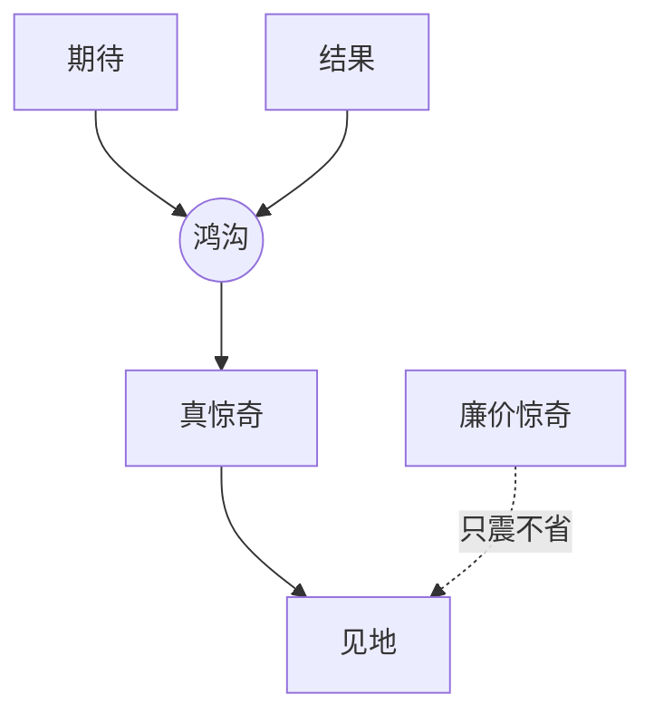

# 惊奇（Surprise）

> English: [[wiki/en/concepts/surprise|English]]

## 定义
**惊奇**是期待的逆转。麦基区分两种：**真惊奇**——来自"期待与结果之间的鸿沟（[[the-gap]]）"突然显现，**并伴随见地**；**廉价惊奇**——利用观众在黑暗中的脆弱性制造无意义的震动。

## 麦基的论述
观众祈祷的是惊奇——一次经验，而非一次确认。如果观众所期待的事发生了，或按他们所期待的方式发生了，故事即失败。但惊奇必须是挣来的：真惊奇之后必有"一股见地的涌入，关于虚构世界表层之下真相的揭示"。亚里士多德早已抱怨："将行而不行是最糟的——震人而不悲人。"

## 运作机制
- **从鸿沟出发**。真惊奇就是鸿沟被突然揭开——人物与观众同时意识到世界并非他们以为的那样。
- **以见地作结**。逆转之后，观众必须**理解**一件新东西。没有见地，震动即蒸发。
- **把廉价惊奇留给按惯例使用它的类型**（恐怖、奇幻、惊悚）。其他类型中，廉价惊奇是披着技艺外衣的写作失败。
- **转折点是真惊奇的天然归宿**。先堆期待，再在转折处反转。

## 电影案例
- *唐人街*——"她既是我妹妹也是我女儿。" 逆转炸裂，新的理解涌入整部影片。
- *帝国反击战*——"我是你父亲。" 同构。
- *一条叫旺达的鱼*——喜剧惊奇：脱衣时一家人推门进来。鸿沟张开，爆裂成笑声。
- *我喜爱的季节*（反例）——一场被揭示为梦境的恐怖 POV 震动；在严肃家庭剧中使用廉价惊奇。

## 与其他概念的关系
- 由鸿沟（[[the-gap]]）驱动，经由转折点（[[turning-point]]）交付。
- 服务于"既必然又意外"（[[inevitable-and-unexpected]]）的教义——无必然的惊奇是随机；无惊奇的必然是公式。
- 由神秘／悬念／戏剧反讽（[[mystery-suspense-dramatic-irony]]）调节——神秘隐藏事实至高潮才兑现；悬念与人物共享事实，在结果处惊人；戏剧反讽则就"为何"给出惊奇。

## 常见错误
- 把震动等同为惊奇。
- 逆转并未带来关于世界或人物的新真相。
- 用惊奇掩盖动机空洞。
- 在小节拍上过度使用惊奇，到主要转折点时无弹可发。

## 来源
- 《故事》第16章
