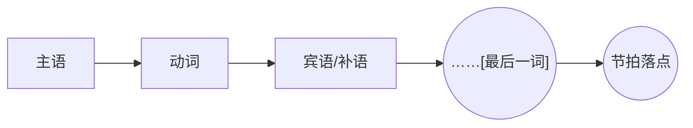

# 悬念句（Suspense Sentence）

> English: [[wiki/en/concepts/suspense-sentence|English]]

## 定义
**悬念句**（英文 periodic sentence）把意义推迟到**最后一个词**，迫使演员与观众同时听到句尾。这是银幕对白（[[dialogue]]）最推荐的语法形状。

## 麦基的论述
糟糕的对白让无用的词——尤其是介词短语——漂在句尾；意义落在中间，尾部一两秒沦为乏味。对手戏的演员等不到切入的提示；观众的视线开始游离。悬念句颠倒这一点：意义落在末尾，恰逢自然停顿。"如果你不想我那么做，干嘛给我那个……吻。"

## 运作机制
- **把回报词装到最后**。语法与情感上都放到末端。
- **削去介词尾巴**。若短语漂过意义之后，节拍被拖。
- **注意切入节奏**。演员在现场会重写对白以使切入更脆；写作时就这样写。
- **长台词尤其适用**。被打断的每一段理想上都落在一个悬念词上。

## 电影案例
- *莫扎特传*——Shaffer 的台词："我想做的只是把歌献给……神。" 几乎每一句都是悬念句。
- 古典悲剧独白——莎士比亚的台词常落在关键词上。

## 与其他概念的关系
- 是对白（[[dialogue]]）的一条句法规则。
- 与节奏（[[pacing]]）在句级对齐——脆的切入节奏维持动力。
- 与无声剧本（[[silent-screenplay]]）互补：当必须说话时，让每一句都重量到句尾最后一音节。

## 常见错误
- 让修饰语（"早上""你知道""在银行"）挂在意义之后。
- 在句中重复意义。
- 把真正的力道放在中间，尾端松塌。

## 来源
- 《故事》第18章
