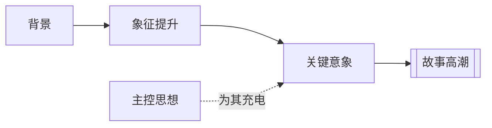

# 象征提升（Symbolic Ascension）

> English: [[wiki/en/concepts/symbolic-ascension|English]]

## 定义
象征提升（Symbolic Ascension）是指故事在编排中，让本来只是“字面上的”图像逐步升高，最终承载普遍性或原型性的意义。

## 麦基的论述
麦基并不要求作者把“这是象征”写在脸上。相反，他强调应让图像的意义慢慢积累。故事可以从完全日常的场景与行动起步，随着推进，这些图像逐渐带上神话、仪式、牺牲或命运的重量。

## 运作机制

## 电影案例
- **[[the-deer-hunter]]**（《猎鹿人》）— 狩猎意象一路升高，最后通向牺牲、怜悯与自我认知。
- **[[the-terminator]]**（《终结者》）— 洛杉矶逐步变成迷宫，萨拉逐步升为神话性母体。

## 与其他概念的关系
- [[controlling-idea]]（主控思想）— 象征提升会加强主题意义的穿透力。
- [[key-image]]（关键意象）— 象征提升往往在关键意象中完成封顶。
- [[story-climax]]（故事高潮）— 最大的象征电荷通常在高潮出现。
- [[setting]]（背景）— 象征往往长在背景里，而不是贴在背景上。

## 常见错误
一旦作者指着画面说“这是象征”，象征的力量反而会立刻漏掉。

## 来源
- 《故事》第12章

