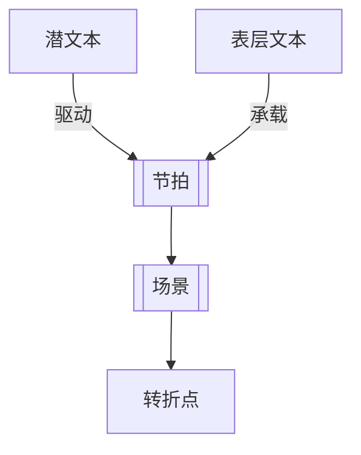

# 表层文本与潜文本（Text and Subtext）

> English: [[wiki/en/concepts/text-and-subtext|English]]

## 定义
表层文本（Text）是场景可见、可听的表面：人物说了什么、做了什么。潜文本（Subtext）则是这层表面之下隐藏的内在生命：欲望、恐惧、判断与没说出口的真相。

## 麦基的论述
麦基强调，场景之所以成立，是因为生活本身就是双层的。人很少真的把内心最深处的话说出来，很多时候甚至连自己也未必完全知道。观众之所以享受故事，正因为它可以透过表面去读到下面那层。

## 运作机制

## 电影案例
- **[[casablanca]]**（《卡萨布兰卡》）— 里克与伊尔莎绕着伤口说话，而真正的戏全在伤口里。
- **[[kramer-vs-kramer]]**（《克莱默夫妇》）— 早餐场景表面在做饭，底层却在暴露一个未成熟男人的崩塌。

## 与其他概念的关系
- [[beat]]（节拍）— 潜文本决定节拍的真实动作性质。
- [[scene]]（场景）— 没有潜文本的场景很容易滑向死板铺陈。
- [[turning-point]]（转折点）— 隐藏层被重新理解时，转折的力量更强。
- [[dramatize-dont-explain]]（戏剧化而非解释）— 潜文本正是戏剧化的重要工具。

## 常见错误
一旦人物把最深的话直接说出来，写作就容易“写在鼻子上”，演员也就没有东西可演了。

## 来源
- 《故事》第11章

