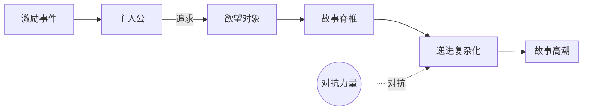

# 追寻（The Quest）

> English: [[wiki/en/concepts/the-quest|English]]

## 定义
**追寻**是麦基的一个核心主张：在类型与形式的千变万化之下，只有一个故事：*一个事件把一个人物的生活推离平衡，唤起他自觉和/或潜意识的欲望——对他认为能恢复平衡之物的欲望——将他推上一场追寻欲望对象的旅程，穿越对抗力量（内心的、个人的、个人外的）。他或得偿所愿，或失之交臂。*

## 麦基的论述
如音乐的十二个音符，故事的本质形式简单——而一切我们称之为故事的东西自人类文明开端以来皆由此谱出。要把自己的故事看作追寻，只需指认[[protagonist]]（主人公）的[[object-of-desire]]（欲望对象）：这一点便揭示出[[inciting-incident]]（激励事件）要把他送上的弧线。

## 电影案例
- *大白鲨* — 追寻：摆脱鲨鱼的安全。
- *飞进未来* — 追寻：成熟。
- *温柔的怜悯* — 追寻：有意义的人生。

## 与其他概念的关系
- [[inciting-incident]]（激励事件）— 启动追寻。
- [[object-of-desire]]（欲望对象）— 定义追寻。
- [[spine]]（故事脊椎）— 追寻的统一力。
- [[progressive-complications]]（递进复杂化）— 追寻的躯干。

## 常见错误
- 把"追寻"当作冒险片的类型同义词；麦基说的是普遍的深层形式。

## 来源
- 《故事》第8章（"激励事件"）
