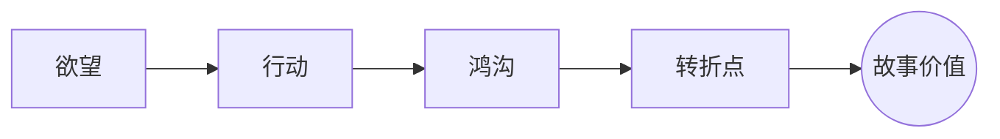

# 转折点（Turning Point）

> English: [[wiki/en/concepts/turning-point|English]]

## 定义
转折点（Turning Point）是指一个[[scene|场景]]或更大叙事单元中，期待与结果发生分裂、并让角色的价值状态发生实质性翻转的时刻。

## 麦基的论述
麦基把转折点视为场景设计的发动机。角色朝欲望采取行动，现实却以他没料到的方式回击，于是[[the-gap|鸿沟（The Gap）]]被撕开。这个冲击先制造惊讶，再引出好奇，最后逼迫观众重新理解前面已经发生过的一切。

## 运作机制

转折点不只是一个“吓你一下”的瞬间，它必须把故事推向新的方向。价值一旦翻转，随之而来的行动线也必须改变。

## 电影案例
- **[[trading-places]]**（《颠倒乾坤》）— 比利·雷的人生突然从街头求生翻到金融通道。
- **[[wall-street]]**（《华尔街》）— 巴德·福克斯的选择同时翻转了财富与良知。
- **[[chinatown]]**（《唐人街》）— 伊芙琳的坦白把影片推入更黑的真相。

## 与其他概念的关系
- [[the-gap]]（鸿沟）— 每个转折点内部真正运作的机制。
- [[scene]]（场景）— 转折点最直接的容器。
- [[story-values]]（故事价值）— 被翻转的是价值的正负状态。
- [[setup-and-payoff]]（铺垫与回报）— 决定转折点是“成立”还是“硬拐”。

## 常见错误
很多作者把信息量、惊吓感或动作量误当作转折点。只要价值没有变化，场景再热闹，也没有真正转动。

## 来源
- 《故事》第10-11章

