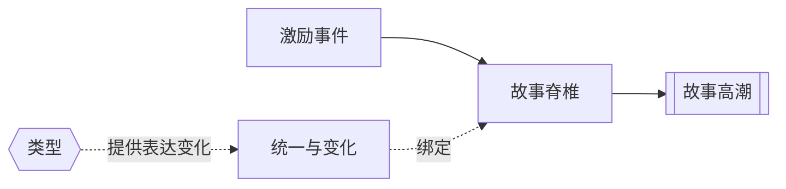

# 统一与变化（Unity and Variety）

> English: [[wiki/en/concepts/unity-and-variety|English]]

## 定义
统一与变化（Unity and Variety）是编排中的双重要求：故事整体必须因果锁定，同时内部必须持续提供对比、新鲜感与层次变化。

## 麦基的论述
所谓统一，是指结尾回头看时会觉得：正因为[[inciting-incident|激励事件]]发生了，所以[[story-climax|故事高潮]]非如此不可。所谓变化，则是旅程不能一直打同一个拍子。只要仍然服从同一条[[spine|故事脊椎]]，爱情、政治、喜剧、动作与氛围都可以成为可控的变化来源。

## 运作机制

## 电影案例
- **[[casablanca]]**（《卡萨布兰卡》）— 爱情、政治、机智与音乐共存于同一条故事线内。
- **[[jaws]]**（《大白鲨》）— 鲨鱼袭击因果性地逼向终局对抗，同时影片内部不断换气与变调。

## 与其他概念的关系
- [[inciting-incident]]（激励事件）— 锁住全局因果的深层起因。
- [[spine]]（故事脊椎）— 保持统一的欲望线。
- [[story-climax]]（故事高潮）— 检验整部作品是否真正锁合。
- [[genre]]（类型）— 变化感的重要来源之一。

## 常见错误
只有变化没有统一，会像一串散片；只有统一没有变化，则会显得僵硬、单调、机械。

## 来源
- 《故事》第12章

