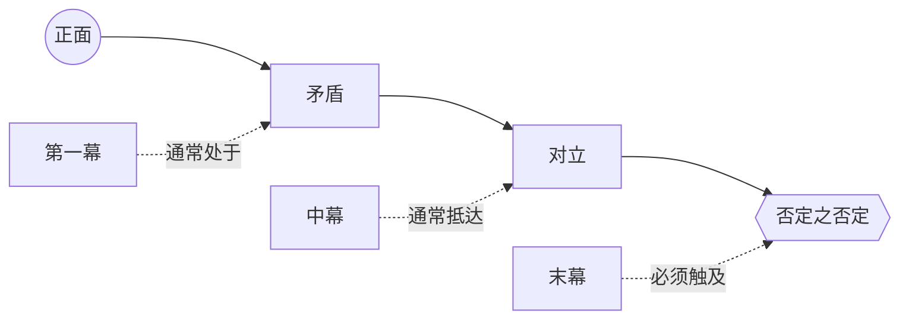

# 价值进阶（Value Progression）

> English: [[wiki/en/concepts/value-progression|English]]

## 定义
**价值进阶**是故事中心价值沿四个站点递降的图谱——**正面 → 矛盾 → 对立 → 否定之否定（[[negation-of-the-negation]]）**。它是麦基为故事做诊断的坐标，也是递进复杂化（[[progressive-complications]]）获得**深度**而非单纯堆叠的路线图。

## 麦基的论述
生活不是非此即彼。正面与对立之间存在不同程度的黑暗，最负面的状态并非"单纯的对立面"，而是抵达人类体验极限的复合负面。穿越四站的故事抵达极限；止步于矛盾或对立的故事只是平庸。

## 运作机制
- **确定首要价值**——高潮所围绕、真正决胜的那个价值。
- **为该价值命名四站**：矛盾是部分负面；对立是直接反面；否定之否定则是质变更糟的复合状态。
- **绘制故事的下行路径**。典型进阶：
  - 第一幕：正面 → 矛盾。
  - 中幕：矛盾 → 对立。
  - 末幕：对立 → 否定之否定，再回到正面（反讽结局）或停在底部（悲剧）。
- **反向进阶也合法**。*卡萨布兰卡*在三条价值上从否定之否定起步，再一路攀回；*飞越未来*直接跳至否定之否定，再照亮每一层灰度。
- **与正向镜像并列**：好→更好→最好→完美。麦基指出它并行存在，但很少对叙事有帮助；真正产生张力的是负向轴。

## 电影案例
- **[[casablanca]]** 卡萨布兰卡——自由、爱、节操三条价值同时反向走完全程：开场即在否定之否定（暴政、自我厌弃、自欺），高潮回归正面。
- **[[chinatown]]** 唐人街——"受许可的自然性行为"：被社会侧目的关系（矛盾）→ 乱伦（对立）→ 与乱伦所生后代再度乱伦（否定之否定）。
- *失踪*（*Missing*）——正义：不公（矛盾）→ 不义（对立）→ 暴政（否定之否定）。
- *伸张正义*——穿越进阶后回返正面。

## 与其他概念的关系
- 在对抗原则（[[principle-of-antagonism]]）下组织对抗力量（[[forces-of-antagonism]]）。
- 为递进复杂化（[[progressive-complications]]）提供深度轴：复杂化必须沿阶梯下行，而非在同一层重复。
- 给主控思想（[[controlling-idea]]）最终定位——故事意义由高潮停留的站点决定。
- 可分别应用于故事里出现的每一种故事价值（[[story-values]]）。

## 常见错误
- 只分两站（正／反），把矛盾与对立合并。
- 止步于对立并宣称"够黑暗了"。
- 名义上抵达否定之否定（一句台词）却未戏剧化呈现。
- 在同一站点重复，而不沿阶梯下行。

## 来源
- 《故事》第14章
