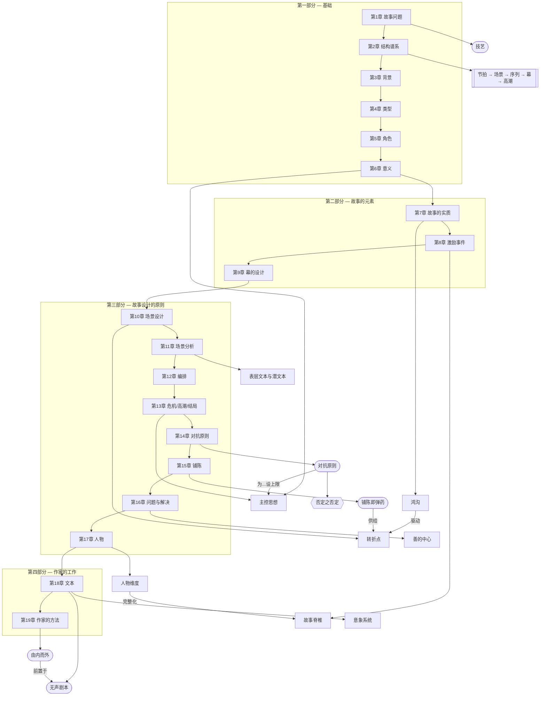

# 全书框架综述（第1-19章）

> English: [[wiki/en/overview|English]]

## 核心论点

到第1-19章为止，麦基逐步建立起一个完整论证：**故事是一门关于有意义选择的工艺，这些选择必须被安排成持续升级、不断转值的形式，然后从内里先做、文字最后才做。** 前半部分定义故事是什么，中段把这些原则落到事件、场景、编排与结尾，最后几章揭示对抗的最深处、信息的配给、人物与文本的构造，以及最终——写作流程本身。

## 主概念图

## 全书论证弧线

### 第1-6章：定义、世界、角色、意义
麦基先为[[craft-maximizes-talent|技艺]]辩护，反对玄学。在[[chapter-02-the-structure-spectrum|第2章]]建立结构层级，再说明故事如何被[[setting|背景]]、[[genre|类型]]、[[character-arc|人物弧光]]与[[controlling-idea|主控思想]]从内部塑形。故事被定义为一种通过价值变化表达意义的结构。

### 第7-9章：发射、追逐、升级
[[chapter-07-the-substance-of-story|第7章]]给出故事的生成单元：[[the-gap|鸿沟]]。[[chapter-08-the-inciting-incident|第8章]]发射[[spine|故事脊椎]]、提出[[major-dramatic-question|主要戏剧问题]]、并投射[[obligatory-scene|必备场景]]。[[chapter-09-act-design|第9章]]通过[[progressive-complications|递进复杂化]]、[[points-of-no-return|不归点]]与[[law-of-conflict|冲突律]]，把追逐扩展成故事的大身体。

### 第10-13章：场景、编排、结尾
[[chapter-10-scene-design|场景设计]]把场景变成精密机器；[[chapter-11-scene-analysis|场景分析]]检查[[beat|节拍]]与[[text-and-subtext|潜文本]]。[[chapter-12-composition|编排]]将场景组合成[[unity-and-variety|波浪]]、[[pacing|节奏]]、[[symbolic-ascension|象征提升]]与[[principle-of-transition|转场]]。[[chapter-13-crisis-climax-resolution|第13章]]补完结尾：[[dilemma|两难困局]] → [[crisis|危机]] → [[story-climax|高潮]] → [[resolution|结局]]。

### 第14章：负面那一侧
[[chapter-14-the-principle-of-antagonism|第14章]]是全书的枢轴。[[principle-of-antagonism|对抗原则]]为前面所有元素设上限：故事只能升至对抗力量将其推到的高度。[[value-progression|价值递进]]（正面 → 相反 → 矛盾 → [[negation-of-the-negation|否定之否定]]）给作者一把工具，把故事一直推到人之极限。

### 第15-17章：信息、技艺失败、人物系统
[[chapter-15-exposition|第15章]]重新定义信息为弹药：[[exposition-as-ammunition|铺陈即弹药]]——配给后引爆，而非倾倒；[[flashback|闪回]]仅在现场承担不动时才用。[[chapter-16-problems-and-solutions|第16章]]目录化反复出现的技艺失败——[[hole|故事漏洞]]、缺失的[[center-of-good|善的中心]]、把[[surprise|惊奇]]误当[[coincidence|巧合]]、松散的[[point-of-view|视点]]、生硬的[[adaptation|改编]]、未挣得的[[melodrama|情节剧]]，以及[[comic-design|喜剧设计]]的特殊要求。[[chapter-17-character|第17章]]把人物作为系统来构建：共情之核[[mind-worm|心虫]]、作为持续矛盾的[[character-dimension|人物维度]]、以及两极化的[[cast-design|人物阵容]]。

### 第18-19章：文本与方法
[[chapter-18-the-text|第18章]]是*最后*一层：[[dialogue|对白]]、[[description|描写]]、[[image-systems|意象系统]]、[[suspense-sentence|悬念句式]]，以及[[silent-screenplay|无声剧本]]检验。[[chapter-19-a-writers-method|第19章]]揭示前面所有原则共同指向的工作流程：[[a-writers-method|由内而外]]——[[step-outline|分步提纲]] → 试讲 → [[treatment|处理稿]] → 剧本——而对白*最后*才写。

## 浮现出来的框架

1. **故事是工艺，不是玄学。**
2. **结构是分层的，每一层都以价值变化为核心。**
3. **世界、类型与角色并非附属，而是从内部塑造结构。**
4. **意义不是被说明出来的，而是被事件安排证明出来的。**
5. **结尾之所以成立，是因为选择与意义先于奇观。**
6. **故事只能升至对抗将其推到的高度。**
7. **信息是弹药，不是说明。**
8. **人物是持续矛盾的系统，不是性格特征的集合。**
9. **文本是最后一层，不是第一层。**
10. **方法是由内而外，对白是最终表层。**

## 关键张力

- **形式 vs. 公式** — 原则能生成创造，公式只能模仿结果。
- **技艺 vs. 才华** — 缺一边就会变成僵硬或失控。
- **表层 vs. 深层** — 文本只有在背后有隐藏动作与意义时才真正成立。
- **期待 vs. 结果** — 鸿沟同时驱动场景与结尾。
- **正面 vs. 否定之否定** — 故事只能升至负面被推到的程度。
- **由内 vs. 由外** — 内在生命先于外在场景；提纲先于对白。
- **自由 vs. 必然** — 创作时可以自由，成品回看必须像命中注定。

## 闭环

到第19章，麦基已经合上了前面章节打开的每一个回路。技艺先被辩护（第1章），最终被操作化为方法（第19章）；结构先被定义（第2章），最终被对抗武装（第14章）；意义先被命名（第6章），由事件安排证明（第7-13章），再被防御于情节剧与漏洞之外（第16章），最后编码进文本与意象（第18章）。书的结尾正是每一部剧本开始的地方：作者坐在卡片桌前，由内而外地搭建——把文字推迟到事件、价值与潜文本都被压力测试之后。
