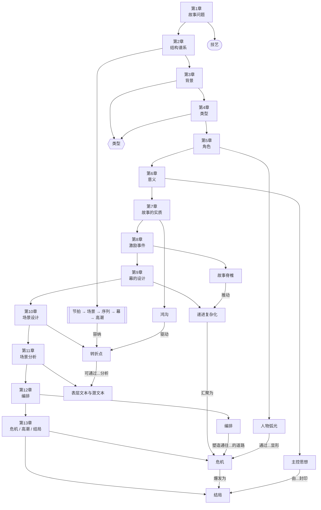

# 全书框架综述（第1-13章）

> English: [[wiki/en/overview|English]]

## 核心论点

到第1-13章为止，麦基逐步建立起一个完整论证：**故事是一门关于有意义选择的工艺，而这些选择必须被安排成持续升级、不断转值的形式。** 前半部分定义故事是什么，后半部分则展示这些原则如何落到事件、场景、编排与结尾。

## 主概念图

## 当前全书论证弧线

### 第1-6章：定义、世界、角色、意义
麦基先为[[craft-maximizes-talent|技艺]]辩护，反对把故事当作玄学或公式。随后在[[chapter-02-the-structure-spectrum|第2章]]建立结构层级，再说明故事如何被[[setting|背景]]、[[genre|类型]]、[[character-arc|人物弧光]]与[[controlling-idea|主控思想]]从内部塑形。到第一部分结束时，故事已被定义为一种通过价值变化表达意义的结构。

### 第7-9章：发射、追逐、升级
[[chapter-07-the-substance-of-story|第7章]]给出故事的生成单元：[[the-gap|鸿沟]]。[[chapter-08-the-inciting-incident|第8章]]发射[[spine|故事脊椎]]、提出[[major-dramatic-question|主要戏剧问题]]、并投射[[obligatory-scene|必备场景]]。[[chapter-09-act-design|第9章]]再通过[[progressive-complications|递进复杂化]]、[[points-of-no-return|不归点]]与[[law-of-conflict|冲突律]]，把追逐扩展成故事的大身体。

### 第10-11章：场景机制与诊断
[[chapter-10-scene-design|场景设计]]把场景变成一台精密机器：[[scene-objective|场景目标]]、阻力、鸿沟与[[turning-point|转折点]]。[[chapter-11-scene-analysis|场景分析]]则把这台机器放慢，让作者能检查[[beat|节拍]]、[[text-and-subtext|表层文本与潜文本]]，以及场景开头与结尾的价值状态。

### 第12-13章：编排与最后一段运动
[[chapter-12-composition|第12章]]讨论如何用[[unity-and-variety|统一与变化]]、[[pacing|节奏控制]]、[[symbolic-ascension|象征提升]]与[[principle-of-transition|转场原则]]，把场景编成波浪、对照与意象上升。[[chapter-13-crisis-climax-resolution|第13章]]则补完结尾模型：真正的选择是[[dilemma|两难困局]]，最后的决定是[[crisis|危机]]，最终不可逆的行动是[[story-climax|故事高潮]]，而余波收束就是[[resolution|结局]]。

## 浮现出来的框架

1. **故事是工艺，不是玄学。**
2. **结构是分层的，而每一层都以价值变化为核心。**
3. **世界、类型与角色并非附属，而是从内部塑造结构。**
4. **场景不是装载说明的容器，而是微型故事。**
5. **意义不是被说明出来的，而是被事件安排证明出来的。**
6. **结尾之所以成立，是因为选择与意义先于奇观。**

## 关键张力

- **形式 vs. 公式** — 原则能生成创造，公式只能模仿结果。
- **技艺 vs. 才华** — 缺一边就会变成僵硬或失控。
- **表层 vs. 深层** — 文本、人物塑造与 spectacle 只有在背后有隐藏动作与意义时才真正成立。
- **期待 vs. 结果** — 鸿沟同时驱动场景与结尾。
- **自由 vs. 必然** — 创作时可以自由，成品回看必须像命中注定。

## 这一阶段说明了什么

到第13章，麦基已经绕完一个关键闭环：先为技艺辩护，再定义结构，再把结构放进世界与意义，最后一路钻进场景设计、编排与结尾。后续章节大概率会在这个已经完整的戏剧核心之外，继续扩展铺陈、对白、人物系统与作者工作法等问题。

