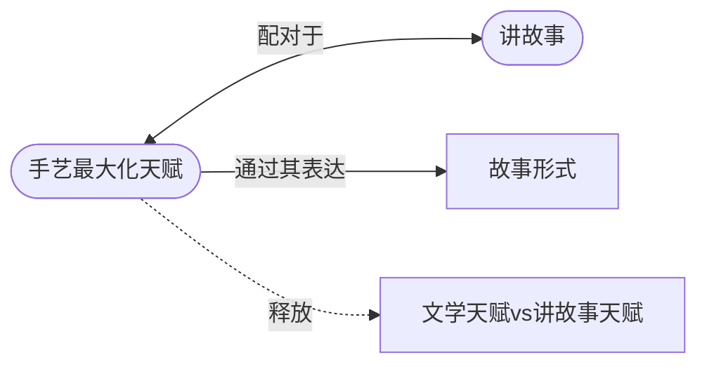

# 手艺使天赋最大化（Craft Maximizes Talent）

> English: [[wiki/en/principles/craft-maximizes-talent|English]]

## 原则

只有天赋（Talent）而没有手艺（Craft），就像只有燃料而没有引擎。它能像野火一样暴烈燃烧，但结果却是徒劳无功。只有运用你所知道的关于讲故事手艺的一切，才能让你的天赋锻造出故事。

## 概念关系图

## 麦基的论证

手艺不是机械操作或花招——它是"我们在自己与观众之间创造兴趣共谋的技术协奏曲"。它是用来将观众拉入深度参与、维持那种参与、并最终以一种动人而有意义的体验来回报的所有手段的总和。

没有手艺，编剧坐在自己的作品前束手无策，无法回答："这是好的？还是垃圾？如果是垃圾，我该怎么办？"意识层面执着于这些可怕的问题，阻塞了潜意识。但当意识层面被投入到执行手艺这一客观任务时，自发性就浮出水面。"对手艺的精通释放了潜意识。"

## 实践应用

编剧日常的节奏：进入想象的世界，在角色说话和行动时写作，然后抽身出来分析性地阅读。"你写，你读；创造，批评；冲动，逻辑；右脑，左脑；重新想象，重写。"重写的质量取决于对手艺的掌握。一个艺术家自觉地运用手艺来创造本能与理念的和谐。

## 电影案例

- 该原则通过对比来阐释：一个有天赋的街头叙事者可以把"我怎么把孩子送上校车"讲得引人入胜，而一个有着真正令人心碎的故事（母亲去世）的人却用表面化的、陈词滥调的讲述让所有人昏昏欲睡。
- "在平庸的素材被精彩地讲述和深刻的素材被拙劣地讲述之间做选择，观众永远会选择前者。"

## 违反的后果

仅依赖"本能"（实际上是对模式的无意识吸收）的编剧产出"僵化受限"的作品——要么模仿他们脑中的原型，要么反叛它，产生商业或艺术院线类型的陈词滥调。

## 来源

- 《故事》第1章"故事的问题"
