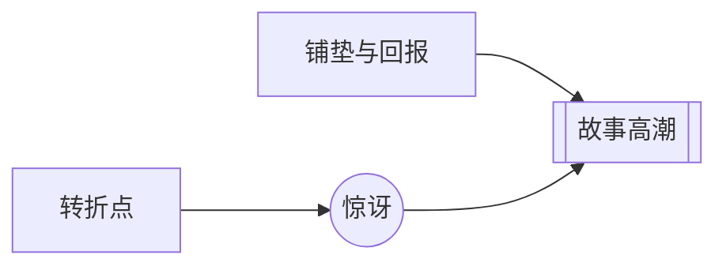

# 必然且意外（Inevitable and Unexpected）

> English: [[wiki/en/principles/inevitable-and-unexpected|English]]

## 原则
一个令人满足的结尾，回头看必须像唯一可能的结尾；但它真正到来时，又必须不是观众原样猜到的那一种到来方式。

## 麦基的论证
这是亚里士多德的标准，也被麦基重新强调。故事前面埋下的铺垫、人物逻辑与世界规则，让结尾具有必然性；而作者对鸿沟与隐藏洞见的管理，则让它保持意外性。

## 实践应用
从结尾往回倒推。确保每个重要片段都在结构上或主题上支撑最终转折。

## 电影案例
- **[[chinatown]]**（《唐人街》）— 结尾惊人，却完全服从这个世界的权力逻辑。
- **[[the-empire-strikes-back]]**（《帝国反击战》）— 每一次新冲击都在加深必然性，而不是破坏它。

## 违反的后果
如果结尾只有必然，没有意外，就会显得套路；只有意外，没有必然，则会显得随便。

## 来源
- 《故事》第13章

