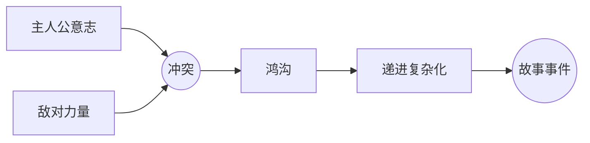

# 冲突律（Law of Conflict）

> English: [[wiki/en/principles/law-of-conflict|English]]

## 原则
**故事中除冲突之外无物推进。** 故事是人生的隐喻，人生以冲突为底色——因此编剧必须在每场戏中找到冲突，否则该场景便不是一个故事事件。

## 麦基的论证
音乐由声与寂推进，舞蹈由动与静推进，故事由冲突的交织推进。去掉冲突，场景便退化为轶事、铺陈或感伤。冲突并非仅指争吵——它是生活在[[levels-of-conflict]]（冲突的层次）之任一层面对主人公意志所施加的任何阻力。

## 实践应用
- 每场戏至少体现一层冲突（内在、个人或超个人）。
- 当一场戏显得无生气时，检查是否缺失敌对——问的不是"反派是谁"，而是"此时此刻有什么在阻挠这个意志"。
- 冲突不必高声喧哗；潜文本的冲突往往最强。

## 电影案例
- *凡夫俗子* — 餐桌即战场，冲突潜行于无声。
- *唐人街* — 即便是铺陈场景也被相互角力的欲望所加压。

## 违反的后果
- **场景扁平：** 对话毫无阻力、无价值变化——非事件。
- **情节剧化：** 把大声当深度。
- **感伤：** 情绪没有摩擦为之赢来。

## 来源
- 《故事》第9章
