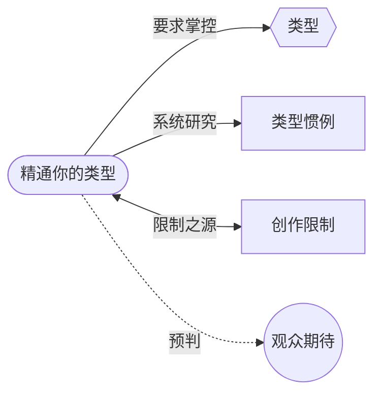

# 精通你的类型（Master Your Genre）

> English: [[wiki/en/principles/master-your-genre|English]]

## 原则

你不仅要尊重，更要精通你的类型及其惯例。千万不要因为看过几部同类型的电影就以为了解了——这就像因为听过贝多芬的全部九部交响曲就以为能谱曲一样。要预判观众的预判，你必须精通自己的类型及其惯例。

## 概念关系图

## 麦基的论证

观众作为类型专家走进每部电影，被营销和一生的观影经历定位到期待特定的模式。如果作者的类型知识不超越观众的，观众就永远领先一步——随之而来的就是厌倦。作者必须系统地而非随意地研究类型。

麦基还认为类型精通提供**持久力**——维持剧本创作所需数月甚至数年的耐力。对想法和自我表达的热爱会在剧本完成前腐烂消亡；对你所在类型的热爱才能支撑你走下去。

## 实践应用

麦基开出了类型研究的具体方法：

1. 列出所有与你作品相似的作品——包括成功和失败的（"对失败的研究能给人启迪……使人谦恭"）
2. 租借/购买电影和剧本
3. 停停走走地研究，按背景、角色、事件和价值拆解每部电影
4. 将分析逐层叠放，从上往下审视："我这一类型里的故事都是干什么的？其时间、地点、人物和动作的惯例是什么？"

## 电影案例

- **[[chinatown|唐人街]]**（*Chinatown*）— 汤恩和波兰斯基对类型的"绝对掌控"使他们能在社会准备好的恰当时刻打破谋杀悬疑片的惯例（罪犯逃脱惩罚）。一部因精通而诞生的经典。
- **阿尔弗雷德·希区柯克** — 完全在大情节和类型惯例内工作，始终面向大众观众，如今被尊为电影史上最伟大的艺术家之一。证明了类型精通与艺术之间没有矛盾。

## 违反的后果

- **《迈克的谋杀案》**（*Mike's Murder*）— 被包装为谋杀悬疑片但实际上是成长情节。错误的定位迷惑了观众，尽管编剧出色，却毁掉了电影的"腿"（持续票房号召力）。
- **《坠入爱河》**（*Falling in Love*）— 在1980年代使用1950年代的爱情故事惯例（婚姻作为阻碍力量），而此时态度已经转变。观众觉得它过时而无聊。

## 来源

- 《故事》第4章，"精通类型"与"持久力的馈赠"
