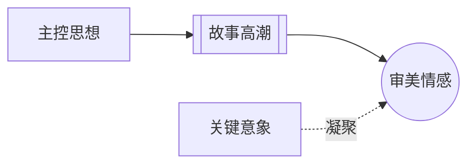

# 意义产生情感（Meaning Produces Emotion）

> English: [[wiki/en/principles/meaning-produces-emotion|English]]

## 原则
观众最深层的情感反应，来自有意义的价值变化，而不是噪音、煽情、明星或单纯 spectacle。

## 麦基的论证
麦基认为，高潮之所以有效，是因为它把某个核心价值推到了最大电荷的翻转上。一个安静的离开也可能毁灭性地动人；一场大战如果没有意义，只会显得空。

## 实践应用
先设计结尾动作“意味着什么”，再去寻找那个最能体现此意义的行动与图像。

## 电影案例
- **[[ordinary-people]]**（《凡夫俗子》）— 贝丝的离开之所以震撼，是因为它完成了整部片子的意义。
- **[[the-deer-hunter]]**（《猎鹿人》）— 高潮之所以沉重，是因为象征与道德意义在同一时刻合拢。

## 违反的后果
当作者把声量误当成意义时，观众可能感到刺激，却很难获得真正的宣泄与满足。

## 来源
- 《故事》第13章

