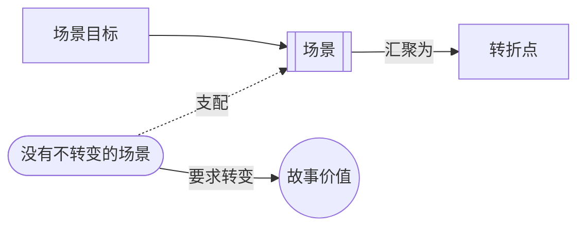

# 没有不转变的场景（No Scene That Doesn't Turn）

> English: [[wiki/en/principles/no-scene-that-doesnt-turn|English]]

## 原则

每个场景都必须让角色生活中的价值状态发生转变。如果场景结尾的价值与开头相同，就没有真正发生有意义的事；这样的场景应该被删除，或被重写。

## 概念关系图

## 麦基的论证

麦基先把它提出为结构理想，到了第10、11章又把它落到场景设计与诊断上。场景存在的意义，是为了追逐目标、遭遇阻力，并最终到达新的价值状态。如果它没有转，就往往是在做解释，而不是在做戏剧。

## 实践应用

对每个场景：（1）先界定[[scene-objective|场景目标]]；（2）记录开头价值；（3）追踪节拍变化；（4）记录结尾价值；（5）找出[[turning-point|转折点]]。如果什么都没变，就把信息搬去别处。

## 电影案例

- **[[tender-mercies]]**（《温柔的怜悯》）— 极静的场景照样在转深层价值。
- **[[casablanca]]**（《卡萨布兰卡》）— 集市场景证明，潜文本与目标再复杂，也仍服从此规则。
- 《虎胆龙威》《亡命天涯》《稻草狗》— 以外部价值转变清晰地通过检验
- 《告别有情天》《乖乖女游世界》— 以更微妙的内在价值转变通过检验

## 违反的后果

不转变的场景产生"一堆毫无生气的、可预测的、拙劣的、充满陈词滥调的段落"（如麦基在他典型的阅读报告中所描述的）。故事停滞不前，观众失去兴趣，作品退化为静态的肖像画或空洞的奇观。

## 来源

- 《故事》第2、10、11章
